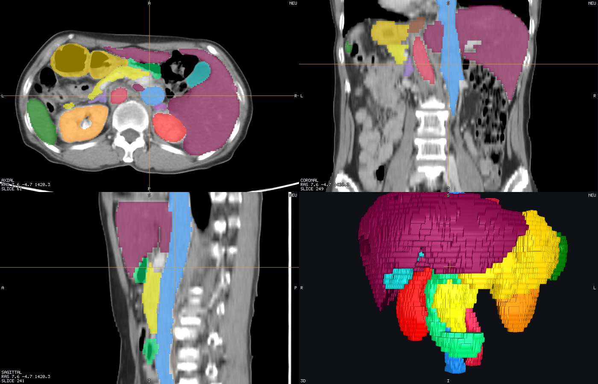
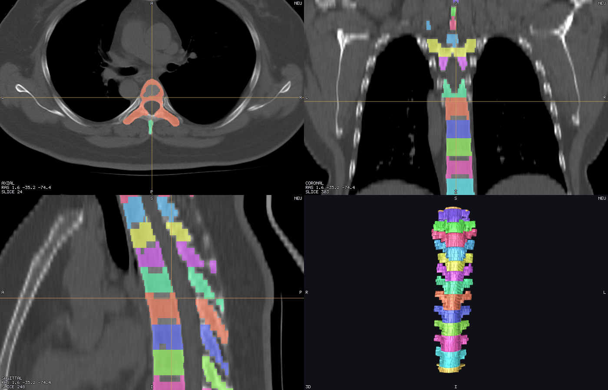
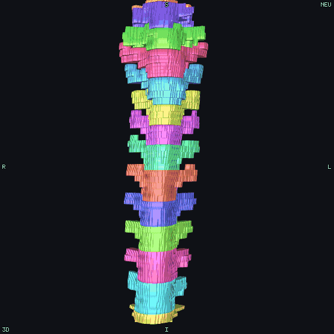

  <picture>
    <source media="(prefers-color-scheme: dark)" srcset="docs/media/logo-dark.png">
    <source media="(prefers-color-scheme: light)" srcset="docs/media/logo.png">
    
  </picture>

<b>A fast desktop viewer for medical volumes and meshes — MRI, CT, segmentations, simulation meshes.</b>

  
  
  
  
  

---

Tetravox opens NIfTI volumes and Gmsh, GIfTI, FreeSurfer, STL, PLY and OBJ meshes side by side: a 3D view
linked to sagittal, axial and coronal slices, so a click in any pane moves the cursor everywhere else. It
reads MRI and CT, label maps and atlases, cortical surfaces and tetrahedral simulation meshes, and renders
them with its own Rust-and-WebGL2 engine, so large meshes and 4D volumes stay responsive. Everything heavy
happens off the interface thread, one worker per dataset, and opening a new file never freezes the window
you are already looking at.

It was built for neuroimaging first — segmented head models, atlases, and simulated tES or TMS fields
checked against the anatomy they were computed on — but nothing in it is head-specific. A chest CT with
organ labels or a lumbar MRI with per-vertebra segmentations opens exactly the same way, with the same
window and level, the same label fill and outline, the same isosurfaces, clip planes, measurements and
coordinate read-out.

  
  

The same engine runs headlessly: a job file, or four lines of Python, renders screenshots, slice sweeps,
orbits and animated parameters exactly as the window would, which is how every picture on the website was
made.

Official builds for macOS (signed and notarised), Linux and Windows are on the
[releases page](https://github.com/idossha/tetravox/releases/latest). Everything else — installing, a
tour of the window, the guide to every control, the automation reference, the gallery, and the
architecture and release process for contributors — lives on the website at
**[idossha.github.io/tetravox](https://idossha.github.io/tetravox/)**.

Tetravox is MIT licensed. Contributions are welcome; start with [`CONTRIBUTING.md`](CONTRIBUTING.md).
