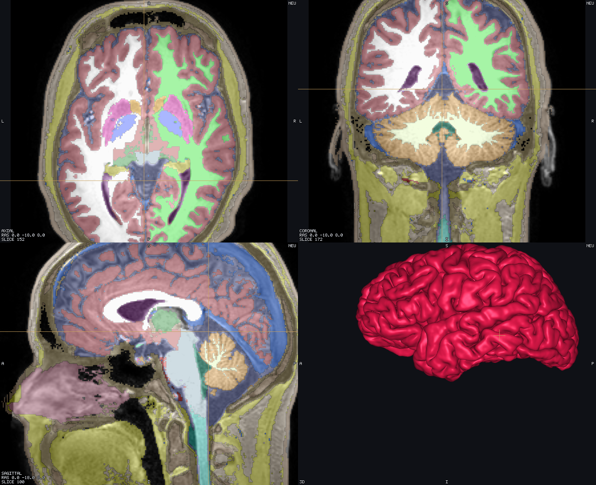
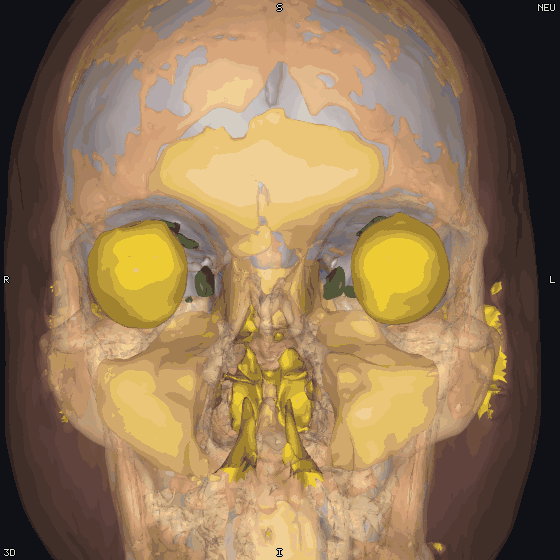

<p align="center">
  <picture>
    <source media="(prefers-color-scheme: dark)" srcset="docs/media/logo-dark.png">
    <source media="(prefers-color-scheme: light)" srcset="docs/media/logo.png">
    
  </picture>
</p>

<p align="center"><b>A fast desktop viewer for medical volumes and meshes — MRI, CT, segmentations, simulation meshes.</b></p>

<!--
  Five badges, short labels, `style=flat` on all of them: any more and GitHub wraps the row onto a
  second line at README width. The CI badge covers the release workflow too — release.yml builds the
  same matrix as ci.yml's `package` legs, so a separate "release workflow" badge said the same thing
  twice and cost a line break.

  The release badge reads the newest **tag**, not the newest release, because shields' `github/v/release`
  ignores DRAFT releases and renders "no releases or repo not found" until one is published. Once
  v0.2.0 (or any later tag) is published rather than left as a draft, switch the URL back to:
      https://img.shields.io/github/v/release/idossha/tetravox?style=flat
  which then also tracks pre-release/latest properly.
-->
<p align="center">
  <a href="https://github.com/idossha/tetravox/releases"></a>
  <a href="https://github.com/idossha/tetravox/actions/workflows/ci.yml"></a>
  <a href="https://idossha.github.io/tetravox/"></a>
  
  <a href="LICENSE"></a>
</p>

---

## What it is

Tetravox opens NIfTI volumes and Gmsh/GIfTI/FreeSurfer/STL/PLY/OBJ meshes side by side: a 3D view linked to
sagittal, axial and coronal slices, so a click in any pane moves the cursor everywhere else. It reads MRI and
CT, label maps and atlases, cortical surfaces and tetrahedral simulation meshes, and renders them with a
custom WebGL2 engine so large meshes and 4D volumes stay responsive.

Neuroimaging is what it was built for first — segmented head models, atlases, simulated tES and TMS fields —
but nothing in the viewer is head-specific: a chest CT with organ labels or a lumbar MRI with per-vertebra
segmentations opens exactly the same way.

Loading, parsing and geometry work happen off the UI thread, one worker per dataset, so opening a new file
never freezes the window you're already looking at. The app runs on macOS and Linux.



### Not only brain

<p align="center">
  
  
</p>

Window/level, label fill and outline, isosurfaces, clip planes, measurements and the coordinate read-out do
not know or care which part of the body they are looking at. More in the
[gallery](https://idossha.github.io/tetravox/gallery).



## Features

- **Formats** — NIfTI-1/2, Gmsh `.msh`, GIfTI, FreeSurfer surfaces, STL/PLY/OBJ
- **Linked views** — a 3D pane plus sagittal/axial/coronal slices that stay in sync, with layouts from a
  single pane to 1-plus-3
- **Overlays & atlases** — layered volumes with linear and heat scales, thresholds, 15 colormaps, window/level
  presets for CT and MRI, and label maps with fill/outline rendering and per-region show/hide/recolour
- **Meshes, cuts & isolation** — tissue surfaces from tags, node/element field colouring, up to six clip
  planes with exact per-element caps, and element isolation by tag, field, sphere, box or atlas region
- **Isosurfaces** — 3D isosurfaces generated directly from a volume layer
- **Glyphs** — vector field glyphs with four length-scaling models
- **Electrodes** — SimNIBS-style electrode and gel geometry, EEG nets and sEEG leads rendered from
  simulation meshes and point sets
- **Simulated fields** — tES (TI, tDCS, tACS) and TMS E-fields on a volume or a mesh, thresholded over the
  anatomy with a labelled colour bar
- **Measurements** — a world-millimetre measurement tool and a region panel
- **Coordinates** — world RAS, per-volume voxel and tkr-RAS, MNI (affine and nonlinear), surface vertex
  index, and fsaverage vertex mapping
- **Scenes** — `*.tetravox.json` saves every layer, region edit, measurement and camera setting, with
  relative paths and a relocate dialog when data moves
- **Automation** — a scriptable job format and a Python client for headless screenshots and sweeps
- **Themes** — light and dark

## Download & install

Grab the latest build from the [Releases page](https://github.com/idossha/tetravox/releases/latest).

**macOS** — the app is unsigned, so Gatekeeper blocks it on first launch. After copying it to
`/Applications`, run once:

```sh
xattr -dr com.apple.quarantine /Applications/Tetravox.app
```

**Linux** — the AppImage needs the executable bit set before it will run:

```sh
chmod +x Tetravox-*.AppImage
./Tetravox-*.AppImage
```

A `.deb` package is also published for Debian/Ubuntu-based systems.

## Quick start

1. Launch Tetravox and choose **Open File(s)** (or drag files onto the window).
2. Load a volume (e.g. a T1 NIfTI) and, optionally, a mesh or surface alongside it.
3. Click anywhere in the 3D view or a slice pane to move the cursor everywhere else.
4. Use the layer panel to adjust colormaps, thresholds, clip planes and visibility.
5. Save your setup with **Save Scene** (`*.tetravox.json`) to reopen it later.
6. Switch between light and dark themes from the settings menu.

## Scripting

Tetravox can also run headlessly from Python, for batch figures or videos:

```python
from tetravox import Job

Job(files=["T1.nii.gz", "surface.gii"], preset="plain") \
    .screenshot("figure.png", view="axial", width=1600, dpi=300)
```

See [`docs/AUTOMATION.md`](docs/AUTOMATION.md) and [`examples/`](examples/) for more.

## Documentation

Full documentation, including the user guide and automation reference, lives at
**[idossha.github.io/tetravox](https://idossha.github.io/tetravox/)**.

## Showcase

A 109-second tour of the interface and the rendering engine, rendered frame by frame by the app itself:
[watch it on the website](https://idossha.github.io/tetravox/showcase) or grab
[`docs/media/showcase.mp4`](docs/media/showcase.mp4).

## Status & limitations

Tetravox is actively developed and tested against real MRI, CT and head-model datasets. Known gaps:

- **Windows** is not officially supported (best-effort only; no packaged build).
- **3D volume raycasting** (MIP / transfer-function rendering of raw volumes) does not exist yet —
  isosurfaces are supported, but a full volumetric raycaster is not.
- See [`docs/ROADMAP.md`](docs/ROADMAP.md) for the complete list of open work.

## Contributing

Contributions are welcome. See [`AGENTS.md`](AGENTS.md) for how the project is built and tested, and
[`docs/`](docs/) for the architecture and design decisions behind it.

## License

[MIT](LICENSE)
