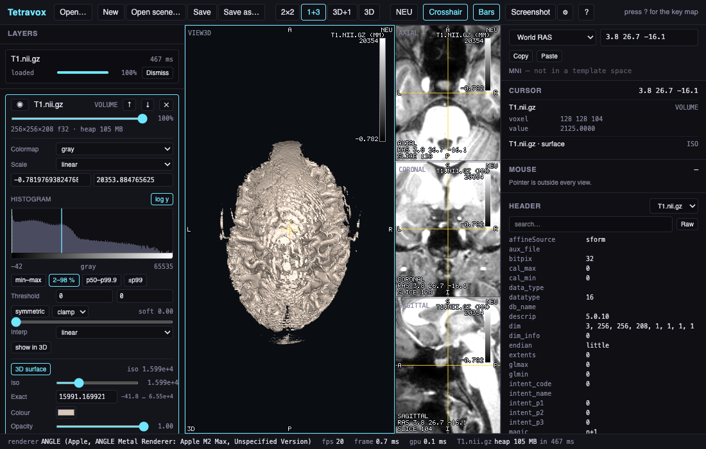

# Tetravox

A desktop viewer for **voxel volumes** (NIfTI-1/2) and **finite-element / surface meshes** (Gmsh `.msh`,
GIfTI, FreeSurfer, STL/PLY/OBJ), with a linked 3D view and sagittal / axial / coronal slices. Rendering is a
custom WebGL2 engine in TypeScript; parsing and geometry are Rust compiled to WASM, one worker and one wasm
instance per dataset, so nothing heavy ever touches the UI thread. The shell is Electron; the targets are
macOS and Linux.



## What it does

* **Volumes** — N composited layers per plane, linear and heat scales, thresholds with a soft edge, 15
  colormaps, label atlases with fill/outline and per-region show/hide/recolour, 4D frames, and 3D
  isosurfaces owned by the volume layer.
* **Meshes** — tissue surfaces from tags, node and element field colouring, up to six clip planes with
  **exact per-element caps**, element isolation by tag / field / sphere / box / atlas region, element edges,
  and vector glyphs with four length-scaling models.
* **Cross-sections** — a tet mesh shows filled tissue polygons and boundary contours in the 2D panes and
  sweeps with the slice, with or without a volume loaded. Surfaces draw Freeview-style outlines.
* **Coordinates** — world RAS, per-volume voxel and FreeSurfer tkr-RAS, MNI through a SimNIBS `toMNI/`
  folder (affine and nonlinear kept separate), surface vertex index, and an fsaverage vertex when a
  `sphere.reg` is on disk.
* **Tools** — a measurement tool in world millimetres, a region panel, a histogram with draggable window and
  threshold handles, an orientation cube and a scale bar, light and dark themes, and screenshots with the
  DPI written into the PNG.
* **Scenes** — `*.tetravox.json` remembers every layer setting, region edit, measurement, camera and the
  theme, with relative paths and a relocate dialog when the data has moved.

## Running it

```sh
pnpm install
pnpm exec electron --version   # warms the ~100 MB binary on a cold machine
pnpm dev                       # the app, against the dev server
```

```sh
pnpm build      # wasm + every package
pnpm package    # THIS platform's artefacts only (.dmg on macOS, .AppImage/.deb on Linux)
pnpm test       # cargo test --workspace + vitest
pnpm e2e        # Playwright, in Chromium and in Electron
pnpm typecheck · pnpm lint
```

`pnpm wasm` builds `crates/tvx-wasm` → `packages/wasm/pkg` and is a prerequisite of `build` / `test` /
`typecheck`. `pkg/` is generated and git-ignored (except the committed `tvx_wasm.d.ts` stub) and is never a
pnpm workspace member.

On macOS the app is **unsigned**: `xattr -dr com.apple.quarantine /Applications/Tetravox.app` once, and see
the user guide for why.

## Scripting it

The same engine runs offscreen, with no window and no stolen focus, so a batch of figures or a video can
render while you work:

```python
from tetravox import Job

Job(files=["m2m_ernie/T1.nii.gz", "sim_TI_max.nii.gz"], preset="ti-field-on-t1") \
    .set(cursor=(0, -18, 8)) \
    .screenshot("axial.png", view="axial", width=1600, dpi=300) \
    .sweep("sweep", view="axial", count=24, fps=12, format="mp4") \
    .run("figures/")
```

Or without Python: `Tetravox --job job.json --out DIR`.

## Where things are

| Path | What |
|---|---|
| [`docs/ARCHITECTURE.md`](docs/ARCHITECTURE.md) | **The contract.** Coordinates (§3), data model (§4), threading (§5), Rust + worker-protocol APIs (§6), rendering (§7), the app (§8), budgets (§9), verification (§11), CI (§12). Read it first. |
| [`docs/USER_GUIDE.md`](docs/USER_GUIDE.md) | Using the app: opening data, navigating, layers, regions, measuring, scenes, themes. |
| [`docs/AUTOMATION.md`](docs/AUTOMATION.md) | The job file and the Python client, in full. |
| [`docs/TESTING.md`](docs/TESTING.md) | Running the suites, the golden policy, and how to add a pixel test. |
| [`docs/ROADMAP.md`](docs/ROADMAP.md) | What exists and what is open. |
| [`docs/DECISIONS.md`](docs/DECISIONS.md) | Append-only log of why things are the way they are. |
| [`docs/BENCHMARKS.md`](docs/BENCHMARKS.md) | The measured numbers §9 is read against. |
| [`AGENTS.md`](AGENTS.md) | Commands, test data and the working rules. |
| `crates/` | `tvx-core`, `tvx-nifti`, `tvx-mesh-io`, `tvx-geom` (pure Rust, native + wasm), `tvx-wasm` (bindings). |
| `packages/` | `@tetravox/protocol`, `@tetravox/wasm`, `@tetravox/engine`, `@tetravox/app`. |
| `python/` | the automation client (stdlib only). |

## Status and limitations

Everything above works today, on real SimNIBS subjects, and is covered by 235 Rust tests, 1,128 vitest tests
and 66 Playwright specs with 40 goldens. Known gaps, with more in the roadmap:

* **macOS and Linux only.** No Windows build, and none planned.
* **Unsigned.** No notarisation and no auto-update while that is true.
* Transparency is a two-phase back/front split — exact for nested convex shells, approximate for folded
  cortex. Depth peeling is the next step.
* Nearest-sampled label volumes drop thin structure when a pixel covers more than one voxel.
* Isosurfaces cannot be clipped, and a 3D volume raycast (MIP / transfer function) does not exist yet.
* No DICOM, no tractography, no remote loading. Loading a 4D NIfTI and stepping frames works; playback does
  not.

## Licence

MIT.
