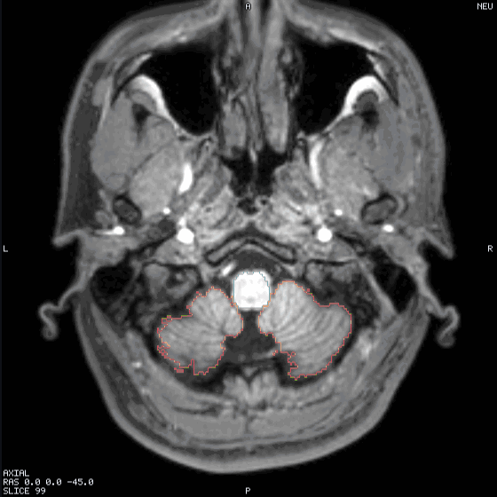

# Automation — `--job`, the job schema, and the Python client

Tetravox can be driven from a script: load data, auto-configure a visualisation, and capture
screenshots, slice sweeps and 3D turntables. It is the same application and the same WebGL2 engine the
window runs — nothing here is a second, headless renderer — so a picture a job produces is a picture
the product produces.

**A job never puts a window on your screen and never takes focus.** `--job` forces the offscreen mode
`packages/app/src/main/window.ts` documents: the `BrowserWindow` is built, renders on the GPU, and is
never shown. `TETRAVOX_E2E_HEADED` does not override it — a batch render must not interrupt whatever
you are doing halfway through.

```sh
Tetravox --job job.json --out figures/ [--quiet]
```

Exit status is `0` when every action succeeded and `1` otherwise, and `figures/job-result.json` says
what was written, how long it took, and what went wrong.

<figure class="shot">
  
  <figcaption>A simulated field as a thresholded heat overlay on a T1 and on the grey-matter mesh, produced by a job</figcaption>
</figure>

---

## 1. Ten seconds of Python

```sh
pip install -e python/
```

```python
from tetravox import Job

result = (
    Job(files=["m2m_ernie/T1.nii.gz", "Simulations/…/sim_TI_max.nii.gz"], preset="ti-field-on-t1")
    .set(cursor=(0, -18, 8), view="axial", mm_per_px=0.3)
    .screenshot("axial.png", view="axial", width=800, dpi=300, crosshair=False)
    .sweep("sweep", view="axial", start=-50, stop=70, count=24, fps=12, format="mp4")
    .run("figures/")
)
result.raise_for_status()
print(result.files)
```

That is the picture above, plus a 24-frame GIF and an MP4. Four runnable examples are in
[`examples/capture/`](../examples/capture).

---

## 2. The job file

A job is one JSON document: **a scene, a window, and a list of actions**. Actions run in order against
one loaded scene, which is the point — loading `ernie.msh` is 184 MB and about a second, and six
figures from six launches would pay for it six times.

```jsonc
{
  "version": 1,                                    // optional; must be 1 when present
  "scene": { "files": ["…/T1.nii.gz"], "preset": "ti-field-on-t1" },
  "window": { "width": 1400, "height": 900 },      // optional; default 1400×900, no panels
  "actions": [
    { "type": "set", "cursor": [0, -18, 8], "mmPerPx": 0.3, "view": "axial" },
    { "type": "screenshot", "out": "axial.png", "view": "axial", "width": 800, "dpi": 300 },
    { "type": "sweep", "view": "axial", "out": "sweep", "from": -50, "to": 70, "count": 24 },
    { "type": "orbit", "out": "orbit", "frames": 36, "degrees": 360, "axis": "z" }
  ]
}
```

Relative paths in `scene` resolve against the **job file's** directory. Output names resolve against
`--out` and may not escape it — a leading `/` or a `..` is rejected before anything runs.

A scene path may also name an environment variable as `${NAME}`, which is how a **committed** job can
point at data that does not live in the repository:

```json
{ "scene": { "files": ["${TETRAVOX_TESTDATA}/m2m_ernie/T1.nii.gz"], "preset": "ti-field-on-t1" } }
```

`docs/TESTING.md` already makes `TETRAVOX_TESTDATA` the name of the SimNIBS subject to work against, so
a job using it runs on anyone's checkout and on none of the alternatives: an absolute path is
reproducible on exactly one machine, and `../../../../datasets/…` encodes a guess about where the
checkout sits next to the data. Only `${NAME}` is expanded — a bare `$NAME` is left alone, because a
`$` in a file name is legal — and an **unset** variable is an error rather than an empty string.

**The window is the render target.** A job's window has no panels: the whole of it is the view grid,
because a screenshot comes off the engine's canvas and never contains the panels anyway. A bigger
window is a sharper picture, not a bigger crop.

`"window": { "width": 1920, "height": 1080, "panels": true }` is the one exception, and it exists for
the one job the engine cannot photograph: a **tour of the interface**. It keeps the §8 shell on
screen — toolbar, layer panel, region list, tissue table, status bar — and `view: "window"` on a
`screenshot` or a `tween` captures the whole window rather than the canvas, through `capturePage` in
main. Every other capture still comes off the engine, which is what keeps a job's output honest;
`panels` changes what is *in the window*, never what the engine draws. Note that the layer panel
shows every layer the scene loaded, so a tour usually wants a **small** scene of its own.

### 2.1 `scene`

Either a saved scene, which restores everything it carries — layers, colormaps, thresholds, the camera
([ARCHITECTURE §4.6]({{ site.baseurl }}/ARCHITECTURE.html)):

```json
{ "scene": { "path": "study.tetravox.json" } }
```

…or a list of files plus a preset:

```json
{ "scene": { "files": ["T1.nii.gz", "ernie.msh"], "preset": "mesh-tissues-translucent" } }
```

Files are opened exactly as the Open… dialog opens them, so a mesh's `.msh.opt` and a label volume's
`_LUT.txt` are found beside it and the tissues come out named and coloured rather than as `tag 1005`.

### 2.2 Presets

A preset auto-configures the layers it recognises. **Every number a preset picks is read off the data**
— a threshold typed into a preset would render an empty pane on one subject and a solid block on the
next.

| Preset | What it does |
|---|---|
| `plain` | Loads the files and leaves them alone. |
| `ti-field-on-t1` | The field-over-anatomy preset. Grey anatomy underneath; a simulated field over it on a `hot` scale, thresholded at the field's own **90th percentile** with the scale running p90 → p97 → p99.9, colour bar on. It is not specific to one stimulation paradigm: the field can be any `*_max.nii.gz` volume (a tES `TI_max`, a tDCS or tACS magnitude, a TMS E-field) or a mesh carrying a scalar field — `TI_max` when it has one, otherwise the mesh's own field. The id is kept for compatibility with existing jobs. p99.9 rather than the maximum because `Thalamus_TI.msh` peaks at 10.29 V/m against a p99.9 two orders of magnitude below it, and a max-anchored scale renders everything below the peak in the bottom colour. |
| `mesh-tissues-translucent` | Scalp at 0.3, skull at 0.5, opaque grey and white matter, both faces drawn. Only tags the mesh actually has are styled. |
| `atlas-outline` | The label volume as outlines (`nearest` interpolation — interpolating a label volume invents ids that are not in the file) over whatever anatomy is loaded. |

A preset that cannot find what it needs records a **warning** in `job-result.json` and carries on; it
never invents a lookalike.

### 2.3 Actions

#### `set` — change the scene

| Key | Meaning |
|---|---|
| `layer` | Which layer `patch` applies to: an index (bottom→top), a name (`"T1.nii.gz"`), a suffix of the dataset's path, or `"active"`. Default `"active"`. |
| `patch` | A `Partial<Layer>` in the app's own vocabulary ([§4.4]({{ site.baseurl }}/ARCHITECTURE.html)) — `{"colormap": "viridis", "opacity": 0.6}` — passed to `Engine.updateLayer` untouched. |
| `active` | Make a layer the **active** one, the same selector as `layer`. It is what clicking a row in the layer panel does, and it is invisible to an engine screenshot — it decides which controls a `view: "window"` capture has on screen. |
| `cursor` | `[x, y, z]` in world RAS millimetres. The slice planes are derived from it (§4.5), so this is how you choose a slice. |
| `layout` | `1x1`, `1x3`, `1x3-horizontal`, `2x2`, `3d-only`, `1+3`, `3d+1`. |
| `view` | Which view `camera` / `reset` / `mmPerPx` / `center` / `distance` apply to. Default `view3d`. |
| `camera` | A 3D camera preset: `"1"`–`"6"`, or `A P L R S I`. |
| `mmPerPx` | 2D zoom for `view`. Smaller is closer; the scene default is 0.5, which covers 350 mm on a 700 px pane. |
| `center` | 2D pan for `view`, `[x, y]` millimetres from the scene bounds' centre. |
| `distance` | 3D camera distance from its target, millimetres. Default 400 ≈ a 250 mm field of view. |
| `reset` | Refit `view` to the scene bounds. Note it fits **one** axis of the pane and crops the other, so `mmPerPx` is usually what a figure wants. |
| `radiological` | Radiological convention on or off. |
| `annotations` | `colorbar`, `crosshair`, `orientationLabels`, `cornerInfo`, `scaleBar` — the scene's chrome, as opposed to a single screenshot's `include`. |

#### `screenshot` — one PNG

| Key | Default | Meaning |
|---|---|---|
| `out` | — | File name under `--out`. `.png` is appended when missing. |
| `view` | `grid` | `grid` for the whole view grid, a view id for that pane, `window` for the whole window including the panels (needs `window.panels`), or `figure` for a labelled multi-panel figure (below). |
| `width` / `height` | the pane's | The **output** size. The frame is *rendered* at this size rather than upscaled, so 2400 px is 2400 px of detail. Give one and the aspect ratio is kept. |
| `scale` | 1 | Supersampling: render this much larger and average down. |
| `dpi` | — | Written to the PNG's `pHYs` chunk. |
| `background` | `scene` | `scene`, `white`, `black`, or `transparent`. `black` is the imaging-convention canvas for a plate that will sit on a black page. |
| `autoTrim` | `false` | Crop the border away. |
| `include` | see below | `colorbar`, `orientationLabels`, `crosshair`, `cornerInfo`, `scaleBar`. Defaults: colour bar, orientation labels and corner info **on**, crosshair and scale bar off. The `RAD`/`NEU` badge is never optional (§8) — a screenshot that could drop it would be a laterality hazard the moment it left the application. |

| `figure` | — | With `view: "figure"`: `panels` (view ids, default every pane of the layout, in reading order), `columns` (`0` = auto: 4 → 2×2, 3 → 2+1), `gutterMm` (2), `labels` (`upper` A/B/C · `lower` · `none`), `labelPt` (10), `background` (`white` page or `transparent`). Each panel is its own capture at `width`/`dpi` — so each keeps its own colour bar, letters and scale bar — and the page's `pHYs` carries `dpi`. |

A publication figure in one action — every pane at 85 mm (1004 px at 300 dpi) on a white page:

```json
{ "type": "screenshot", "out": "figure-1.png", "view": "figure", "width": 1004, "dpi": 300,
  "background": "white", "autoTrim": true, "include": { "crosshair": false, "cornerInfo": false },
  "figure": { "columns": 2, "gutterMm": 3, "labels": "upper" } }
```

#### `sweep` — step a 2D view through the volume

<figure class="shot">
  
  <figcaption>An axial sweep through a T1 with the atlas outlined</figcaption>
</figure>

| Key | Meaning |
|---|---|
| `view` | `axial`, `coronal` or `sagittal`. (`view3d` is refused, and points you at `orbit`.) |
| `out` | Base name under `--out`. Frames are `<out>-0000.png`, zero-padded so they sort. |
| `from` / `to` | Millimetres along the view's normal, world RAS. Both default to the scene's extent along that axis, inset 5 %. The default is a survey, not a figure: a T1's box is 255 mm around a 180 mm head, so a default sweep spends its first frames below the chin. |
| `step` \| `count` | Millimetres per frame, **or** a frame count with both ends inclusive. Not both. |
| `fps` | 10 by default. |
| `format` | `"mp4"` or a list. PNG frames and a GIF are **always** written; `format` only ever adds. |
| `colors` | GIF palette size, 2–256 (default 256). |
| `width` / `height`, `background`, `include` | As `screenshot`. |

#### `orbit` — turntable the 3D view

<figure class="shot">
  
  <figcaption>A turntable of per-vertebra isosurfaces from a labelled spine CT</figcaption>
</figure>

| Key | Default | Meaning |
|---|---|---|
| `degrees` | 360 | Total rotation. |
| `frames` | 36 | Frames over `degrees`. The last stops one step short, so a full turn loops with no repeated frame. |
| `axis` | `z` | World axis to orbit about (`z` is superior in RAS). |
| `out`, `fps`, `format`, `colors`, `width`, `height`, `background` | | As `sweep`. |

The camera is put back where it started afterwards, so a `screenshot` after an orbit photographs the
scene the job set up.

#### `tween` — N eased frames between two scene states

`sweep` steps a slice and `orbit` turns a camera; each owns the one parameter it varies. A **tween**
moves anything a number can describe — the cursor, the 3D camera's distance and target, a pane's zoom
and pan, and any numeric field of any layer: an opacity, a clip-plane offset, a threshold, an iso
level, a glyph length — over `frames` frames with an ease. It is what a narrated shot needs, and it is
what [`examples/capture/showcase.py`](../examples/capture/showcase.py) writes the showcase film out of.

| Key | Default | Meaning |
|---|---|---|
| `out` | — | Base name, as `sweep`. |
| `frames` | 30 | Frames, **inclusive of both ends**: frame 0 is the start state and the last frame is exactly `to`. `frames: 1` is therefore a one-frame hold on `to`. |
| `ease` | `inOut` | `linear`, `in`, `out`, `inOut` — the cubic family. |
| `from` | the live scene | The start state. Omitted, each value is read off the scene at the moment the action runs, path by path, so a shot says where it is going and not also where it already is. |
| `to` | — | The end state. |
| `orbit` | — | `{ degrees, axis }`: an eased camera orbit about a **world** axis, run across the same frames and composed with `to.distance` / `to.target`, so one shot can dolly in while it turns. |
| `view` | `grid` | The capture target, as `screenshot` — `window` included. |
| `fps`, `format`, `colors`, `width`/`height`, `background`, `include`, `sequence`, `gif` | | As `sweep`. |

A **state** — `from` and `to` both — is a subset of:

```jsonc
{
  "cursor":   [-33.4, 31.2, 16.3],          // world RAS mm; every 2D pane's slice follows it
  "distance": 260,                          // 3D camera distance, mm
  "target":   [0, 18, 4],                   // 3D camera target, world RAS mm
  "views":    { "axial": { "mmPerPx": 0.13, "center": [-37, 4.5] } },
  "layers":   [ { "layer": "labeling.nii.gz", "patch": { "opacity": 0.9 } } ]
}
```

`layout`, `camera` and `radiological` are deliberately **not** in it: there is no frame that is 40 % of
the way from a 2×2 layout to a 1×1 one. Change those with a `set` between two tweens.

Three rules make a layer tween behave the way a shot means it:

* **Only numbers are interpolated.** A string (`"colormap": "jet"`), a boolean, a `null` — anything
  with no halfway — takes its `to` value from the **first** frame, because a control that flips at the
  last frame reads as a glitch rather than a cut.
* **A tween's patch is deep-merged onto the layer's current value.** `updateLayer` merges a patch at
  the top level only, which is right for `set`, where the caller writes out the whole field. A tween
  names *leaves* — `{"clip": {"planes": [{"plane": {"offset": -16.3}}]}}` — and a top-level merge would
  throw away the plane's normal, the isolation's tags and the glyphs' subsampling along the way.
* **A tween leaves the scene where it ended.** An orbit is a capture and puts its camera back; a tween
  is a move, and the next action starts where this one stopped.

```json
{ "type": "tween", "out": "shot", "frames": 90, "ease": "inOut",
  "orbit": { "degrees": -30, "axis": "z" },
  "to": { "distance": 320,
          "layers": [{ "layer": "ernie.msh",
                       "patch": { "tagStyle": { "1005": { "opacity": 0.2 } } } }] } }
```

`null` in **any** patch — `set`'s as well as a tween's — means *unset the field*. §4.4 uses absence for
"this layer has no isolation / no glyphs / no 3D surface", and JSON has no `undefined`, so
`{"isolate": null}` is how a job turns one of those back off.

#### `sequence` — many actions, one video

A minute of video is not one camera move, and a per-action encode cannot express twenty shots that
have to become one file. Every frame action (`sweep`, `orbit`, `tween`) takes `sequence`:

| value | frame numbering | encodes |
|---|---|---|
| absent | from `0000` | yes — the action is a sequence of one, which is what every job written before this did |
| `"start"` | from `0000` | no |
| `"continue"` | after the frames already written under this `out` | no |
| `"end"` | ditto | yes, over the whole sequence |

All the actions share one `out`, and the encode reads the PNG frames back off disk (`<out>-%04d.png`
is already what ffmpeg's image2 demuxer wants), so a 1,885-frame 1080p video never has to be held in
memory at once.

`gif: false` on a frame action skips the GIF. The GIF is otherwise unconditional so that a machine with
no ffmpeg still gets an animation — the PNG frames are written either way, so that reason survives the
opt-out, and at 1920×1080 over a thousand frames a GIF is neither small nor watchable.

**Frame limits.** A sweep, an orbit or a tween is capped at 720 frames each, and the cap is recorded as
a warning rather than silently applied. A `sequence` is not capped: it is as long as its actions.

#### `save-scene` — write the scene

| Key | Meaning |
|---|---|
| `out` | File name under `--out`; `.tetravox.json` is appended when missing. |

Exactly what File ▸ Save Scene writes ([§4.6]({{ site.baseurl }}/ARCHITECTURE.html)): every layer,
colour map, threshold and camera as they stand after the preceding actions, with dataset paths
**relative to the file**. Run a job beside its data and the scene names bare files — which is how the
scenes shipped with **File ▸ Sample Data…** are produced (`scripts/sample-data/scenes/make-scenes.py`:
files + a preset + a few `set`s + `save-scene`), so their numbers come from the data, not from a
keyboard.

#### `module` — run an extension's operation

An **extension** ([§13]({{ site.baseurl }}/ARCHITECTURE.html)) is a first-party tool with its own panel,
keys and files; the sEEG contact editor is the first. Every button in its panel is also an
*operation*, and this one action type runs them — whichever extension, whichever operation, forever:

```json
{ "type": "module", "module": "tetravox.seeg", "op": "snap",
  "args": { "scope": "all", "radiusMm": 1.5 } }
```

| Key | Meaning |
|---|---|
| `module` | An extension id this build carries. An unknown one is refused with the list of the ones that exist. |
| `op` | One of that extension's declared operations (§2.7). |
| `args` | The operation's own arguments. **An argument it did not declare is an error**, not a key that is quietly dropped. |

The extension's **manifest is the schema**, so the whole action — the id, the operation, every argument
and its type — is checked in main before a window is created, along with every other problem in the
document. Arguments are `number`, `string`, `boolean` (each optional with a trailing `?`), `vec3?`,
and two that name files:

* **`path`** is an input. `${VAR}` is expanded, a relative path resolves against the job file's
  directory, and it is allow-listed for the extension to read — exactly what happens to `scene.files`.
* **`out`** is a name under `--out`, held to the same rule as every other output name, and the
  extension may write it and the companion files its writer declares (`<stem>_editlog.json`) beside it.
  A job never writes over the file it read: an `out` is under `--out` and nowhere else, which is
  also why a save there produces no `.bak` — there is nothing yet to back up.

What the operation returned comes back in the result file, so a job can *ask* as well as render:

```json
{ "action": 2, "type": "module", "module": "tetravox.seeg", "op": "snap",
  "files": [], "ms": 412, "result": { "moved": 96, "meanShiftMm": 0.42 } }
```

The operations each extension offers are listed in §2.7 below, which is generated from the manifests
themselves.

### 2.4 `job-result.json`

```json
{
  "ok": true,
  "schemaVersion": 1,
  "job": "/abs/path/job.json",
  "outDir": "/abs/path/figures",
  "outputs": [
    { "action": 1, "type": "screenshot", "files": ["axial.png"], "ms": 304 },
    { "action": 2, "type": "sweep", "files": ["sweep-0000.png", "…", "sweep.gif"], "ms": 2130 }
  ],
  "timings": { "totalMs": 4820, "loadMs": 1544, "actionsMs": 2434 },
  "warnings": [],
  "errors": []
}
```

`files` are relative to `outDir`, in the order they were written. A run that failed still writes this
file: `ok: false` with the reasons in `errors`, which is what makes a failed batch diagnosable from a
log rather than from a screen.

A job that ran an **extension** operation also carries `modules` — every extension it used and the version
that ran it, so a figure produced by one is re-derivable a year later:

```json
{
  "modules": [{ "id": "tetravox.seeg", "version": "0.1.0" }],
  "outputs": [
    { "action": 0, "type": "module", "module": "tetravox.seeg", "op": "snap",
      "files": [], "ms": 412, "result": { "moved": 96, "meanShiftMm": 0.42 } },
    { "action": 1, "type": "module", "module": "tetravox.seeg", "op": "save",
      "files": ["contacts.tsv"], "ms": 38, "result": { "path": "contacts.tsv" } }
  ]
}
```

The key is **absent** when no extension ran, so every job written before extensions existed produces the
same result file it always did. `result` is whatever the operation returned, and `files` are its
`out` arguments — relative to `outDir`, like every other action's.

### 2.5 Video

**PNG frames and a GIF are always written**, by a GIF encoder inside the app — no external tool is
involved, so the animation path cannot fail because of the machine it ran on. `format: "mp4"` adds an
H.264 file **when `ffmpeg` is on `PATH`**; when it is not, the run still succeeds and records

```
no ffmpeg on PATH — sweep.mp4 was not written (the GIF was)
```

in `warnings`. `TETRAVOX_FFMPEG` names a specific binary.

The GIF's palette is one global table quantised over every frame, and it is not dithered — a shared
palette is what stops consecutive slices of the same volume shimmering between two different greys, and
dithering a medical image invents texture that is not in the data. For a dense 3D render, `colors: 32`
and a smaller `width` are the two knobs that matter: the turntable above is 1.9 MB at 256 colours and
250 kB at 32. An MP4 is a fifth the size of either, at full resolution.

### 2.6 When a job is wrong

The document is validated **before a window is created**, and every problem is reported at once with a
path into the document:

```
[tetravox:job] actions[2].step: must not be 0
[tetravox:job] actions[3].out: must be a relative name inside --out (no leading /, no ..)
[tetravox:job] scene.preset: must be one of plain, ti-field-on-t1, mesh-tissues-translucent, atlas-outline
```

An input file that does not exist is named. A job that produces no result at all within
`TETRAVOX_JOB_TIMEOUT_MS` (default 600 000) fails rather than hanging.

### 2.7 Extension operations

Every operation the **compiled-in fixture** declares, with the arguments each one takes. A
real (installed) extension declares its operations in its own manifest and documents them in
its own repository and the Extensions catalogue, so it is not listed here — the sEEG editor is
one such extension (§13.8). **This section is generated** from the manifests by
`scripts/sync-module-docs.mjs` — the same declarations the job validator checks an action against
— so edit a manifest and re-run the script rather than editing the table. CI checks it with
`--check`.

#### `tetravox.hello` — Hello 1.0.0

| Operation | Arguments |
|---|---|
| `echo` | `text` a string |

---

## 3. The Python client

`python/tetravox/`, **standard library only** — it is meant to drop into an analysis environment that
already has its own pinned scientific stack.

```python
from tetravox import Job, JobError

Job(files=[...], preset="plain", window=(1400, 900))   # or Job.from_scene("study.tetravox.json")
   .set(...)          # layer patch, cursor, layout, camera, zoom
   .screenshot(...)   # one PNG
   .sweep(...)        # PNG frames + GIF (+ MP4)
   .orbit(...)        # PNG frames + GIF (+ MP4)
   .tween(...)        # N eased frames between two scene states
   .module(...)       # one operation of a module (§13)
   .run(out_dir, app=None) -> JobResult
```

Each method returns `self`, so a script reads in the order the app executes it. `to_dict()` /
`to_json()` / `write(path)` give you the document without running anything — useful for a job you want
to submit to a cluster.

`JobResult` carries `ok`, `files` (absolute, in order), `files_for(action_index)`, `timings`,
`warnings`, `errors`, `modules`, `results()`, and `raise_for_status()`.

### Extensions

`Job.module(module_id, op, **args)` runs any operation of any extension, and the argument names are the
extension's **manifest's**, verbatim — `radiusMm`, not `radius_mm` — because the manifest is the schema
the app validates against and a translation table in the client would be a second copy of every
extension's arguments, wrong the moment one is added:

```python
job.module("tetravox.seeg", "snap", scope="all", radiusMm=1.5)
```

`tetravox.modules` is where an extension's vocabulary is written in Python's, per extension: snake_case
parameters, one real signature per operation, and `path` arguments made absolute the way
`Job(files=...)` makes them absolute — which matters, because the job document is written *into the
output directory* and the app resolves a relative path against the document.

```python
from tetravox import Job
from tetravox.modules import seeg

job = Job(files=[ct], preset="plain")
seeg.load(job, ct=ct, tsv=tsv)        # open a CT and a BIDS electrodes table
seeg.snap(job, scope="all", radius_mm=1.5)
seeg.refit(job)                       # PCA line fit, even re-spacing, relabel
seeg.stats(job)                       # per-electrode geometry, no files
seeg.save(job, out="sub-01_space-T1w_electrodes.tsv")

result = job.run("out/").raise_for_status()
print(result.modules)     # [{'id': 'tetravox.seeg', 'version': '0.1.0'}]
print(result.results())   # what each operation reported, in order
```

`results()` is the half a renderer does not have: `stats` writes nothing and answers with numbers, so
a batch over twenty subjects can print a table and produce no files at all. The wrappers are **data**
— they build a document and never import the extension — so they install and run on a machine whose
build does not carry it; the app is what refuses such a job, by name, before it opens a window.

Python's parameter names differ from the JSON in exactly three places, all forced: `sweep(start=, stop=)`
and `tween(start=)` for `from` (a keyword), `sweep(stop=)` for `to`, and `mm_per_px` for `mmPerPx`
(snake case). `sequence`, `gif` and the `include` flags (`colorbar=`, `crosshair=`, …) are on all
three frame methods, so a multi-shot video is expressible without hand-writing JSON;
`Job(..., panels=True)` sets `window.panels`.

### Finding the app

`run()` looks, in order:

1. **`TETRAVOX_APP`** — an executable, or a macOS `.app` bundle. Set it and nothing else is consulted.
2. **The repository's own build** — `packages/app/release/**/Tetravox.app`, or a Linux `AppImage` /
   `linux-unpacked` — when the client is installed from a checkout.
3. **The platform's install location** — `/Applications/Tetravox.app`, or `tetravox` on `PATH`.

Failure lists everywhere it looked, which is the one thing an "app not found" error must do.

Against a **dev build** with nothing packaged, point it at Electron and let `TETRAVOX_APP_ARGS` carry
the app directory:

```sh
pnpm --filter @tetravox/app run build
export TETRAVOX_APP="$PWD/node_modules/.bin/electron"
export TETRAVOX_APP_ARGS="$PWD/packages/app"
python examples/capture/screenshot.py
```

### Examples

All four read `data/ernie/`, which [`scripts/fetch-data.sh`](../scripts/fetch-data.sh) fills from a
SimNIBS subject directory; each stops with the list of files it could not find. See
[`examples/capture/README.md`](../examples/capture/README.md) and [`data/README.md`](../data/README.md).

| Example | What it shows |
|---|---|
| [`screenshot.py`](../examples/capture/screenshot.py) | Two figures — an axial T1 and a pial surface over the T1's 3D planes — from **one** app launch. |
| [`sweep.py`](../examples/capture/sweep.py) | A 32-frame axial sweep through a simulated field as a GIF and an MP4. |
| [`orbit.py`](../examples/capture/orbit.py) | A 36-frame turntable, with the palette and size knobs that keep a GIF shareable. |
| [`showcase.py`](../examples/capture/showcase.py) | The whole showcase film: six jobs, ~2,900 frames, captions burned on with ffmpeg. |

<div class="shot-pair">
  <figure>
    
    <figcaption>A T1 in the 2x2 layout, captured by screenshot.py</figcaption>
  </figure>
  <figure>
    
    <figcaption>The head mesh with translucent scalp and skull, captured by screenshot.py</figcaption>
  </figure>
</div>

---

## 4. How it is put together

Two halves, and the line between them is the one §5 and §8 already draw.

* **Main** (`packages/app/src/main/`) owns the filesystem, the window, ffmpeg and the exit code.
  `job.ts` is the schema and the argv parser, and it is **pure** — which is what lets the schema be
  unit-tested with no Electron and no GPU. `job-runner.ts` is the lifecycle; `gif.ts` and `png.ts` are
  the encoders.
* **The renderer** (`packages/app/src/renderer/src/automation/`) owns every decision about what a
  picture contains, and makes each one through the `Engine` facade and the `ShellController` — the same
  calls a user makes with the mouse. There is no automation-only path into the renderer, which is what
  keeps a job's output honest. `presets.ts` and `frames.ts` are pure and unit-tested; `run.ts` is the
  executor.

**PNG bytes cross IPC; dataset bytes never do.** A screenshot is an image the renderer just produced,
bounded by the window — the same kind of blob the screenshot button already reads back. Raw file bytes
still reach only the dataset's worker, over `tetravox://file/…`, exactly as §5 rule 3 requires. Every
path a job names is added to that allow-list before the renderer asks for it: the job file naming a
path *is* the user naming it.

### Tests

| Test | What it covers |
|---|---|
| `packages/app/src/main/job.test.ts` | The schema, as claims about the document and about what a bad job is told. |
| `packages/app/src/main/gif.test.ts` | The GIF encoder, round-tripped through an independently written reader. |
| `packages/app/src/renderer/src/automation/frames.test.ts` | Sweep offsets and orbit quaternions, checked by rotating vectors rather than by comparing components; the tween's easing curves, its numeric interpolation, and the deep merge that keeps a nested layer field intact. |
| `packages/app/src/renderer/src/automation/presets.test.ts` | The presets, over datasets with known distributions. |
| `packages/app/e2e/automation-realdata.spec.ts` | The whole thing, offscreen, on ernie: a screenshot job, a 10-frame sweep, a 12-frame orbit, the field-over-anatomy preset, and a `window.panels` + `view: "window"` capture asserted to differ from the same scene's `grid` — the images are the requested size, are not blank, and **differ frame to frame**. Skips when `TETRAVOX_TESTDATA` is unset. |
| `python/tests/test_client.py` | The client's documents, and one example end to end against a dev build. Skips when either is missing. |
| `python/tests/test_modules.py` | `Job.module`, the typed sEEG wrappers and `JobResult.results()` — documents only, so they run with no app and no extension in the build. |
| `packages/app/e2e/module-job.spec.ts` | A `--job` launch that activates an extension and runs its operation, asserted through `job-result.json` and the scene it saved. The `tetravox.hello` half runs everywhere (the data is `testdata/`); the sEEG half is gated on `TETRAVOX_SEEG_FIXTURE`, which names a built extension to stage. |
