# Tetravox — user guide

A viewer for **voxel volumes** (NIfTI — MRI, CT, label maps) and **finite-element / surface meshes** (Gmsh
`.msh`, GIfTI, FreeSurfer, STL/PLY/OBJ, VTK `.vtk`/`.vtu`/`.vtp`, OFF, MEDIT `.mesh`), with a 3D view and sagittal / axial / coronal slices that all follow
one crosshair. Head models and neuroimaging are what it was built for first, but every control in this guide
works the same on a chest CT or a lumbar MRI — where that matters, it is said in place. This guide is split
by topic; for installing the app see the website's
[Install](https://idossha.github.io/tetravox/install) and [Get started](https://idossha.github.io/tetravox/get-started) pages.

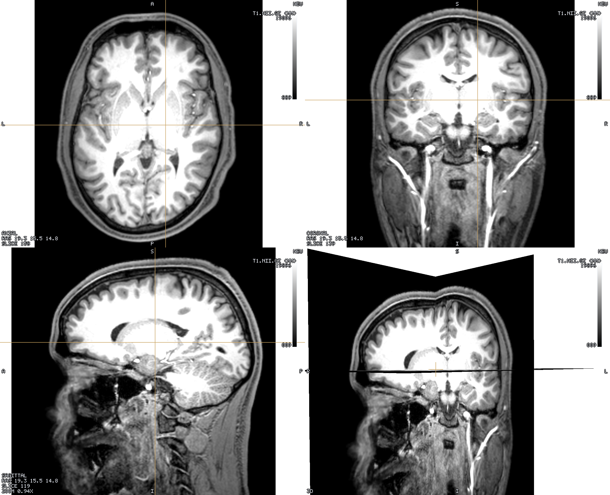

## Opening data & formats

Any of: drag files onto the window, **⌘O / Ctrl+O**, File ▸ Open…, or name them on the command line
(`Tetravox T1.nii.gz ernie.msh`). Opening data **adds** to what is on screen; opening a scene **replaces** it.

**No data to hand?** File ▸ **Sample Data…** lists public datasets — a SimNIBS head with its tissues, pial
surfaces, an EEG net and a TI field; abdominal and chest CT and MRI with organ and vertebra labels — each
with its source and licence. One click downloads the files (once, into the app's cache, verified by
checksum) and opens a **ready-made scene** — layout, colour maps, thresholds and camera already set, the
TI field on its mesh with a clip plane following the cursor — replacing what is on screen, as Open Scene…
does. The scene file sits beside the data in the cache, so File ▸ Save Scene As… keeps your changes to
it. The same list, with sizes and download links, is on the website's Sample data page.

Formats read: NIfTI-1/2 (`.nii`, `.nii.gz`, including 4D), Gmsh `.msh` v2.2 and v4.1, Gmsh parsed views
(`.geo` / `.pos` — SimNIBS electrode nets), GIfTI (`.gii`, `.func.gii`, `.shape.gii`, `.label.gii`),
FreeSurfer surfaces / `curv` / `.annot`, STL, PLY, OBJ.

Sidecars beside a file are picked up automatically and matter more than they look:

| Sidecar | Gives you |
|---|---|
| `<mesh>.msh.opt` | tissue names (WM, GM, CSF …), their colours, and the field range to open at |
| `<volume>_LUT.txt` | region names and colours for an atlas or a tissue map |

`ernie.msh` has no `$PhysicalNames` section, so its `.msh.opt` is the *only* source of tissue names. Without
it the tissue table reads `tag 1`, `tag 2`, … and the head is drawn in a fallback palette.

## The panes

**The crosshair is one point in space** and every pane shows it. Move it and all the panes follow.

| | |
|---|---|
| **Left-click / drag** in a 2D pane | move the crosshair. It never pans the image |
| **Wheel** | step one slice |
| **⌘/Ctrl + wheel**, or a trackpad pinch | zoom about the pointer |
| **Middle-drag**, **Space + drag**, or a two-finger trackpad drag | pan |
| **Right-drag** | window / level on the active layer |
| **Shift + drag** | the active layer's opacity |
| **Arrows** | nudge the crosshair in the plane · **PgUp / PgDn** step slices |
| In the **3D pane**: left-drag orbits, right-drag pans, wheel dollies, **double-click** puts the crosshair on what you clicked | |

`x` cycles the pane layout (1+3, 2×2, single pane, …); `r` resets the active view, or Alt + double-click.
Zoom is per pane: `+` / `-` zoom about the pane centre. Zoom is real resampling of the volume, not a scaled
bitmap — the detail view below is the same slice at 0.12 mm per pixel.

Every 2D pane carries orientation letters on all four edges, a corner block (view, slice index, world RAS)
and a persistent **RAD** / **NEU** badge — the neurological/radiological convention is never implicit. The
**Scale** toggle adds a scale bar in millimetres, and **Cube** adds an orientation cube to the 3D pane whose
faces you can click to snap the camera (also `1`–`6` for A/P/L/R/S/I). Toggle the radiological convention
from the toolbar; it mirrors the image about the vertical axis and nothing else — the badge says which you
are in, always.

`o` toggles orthographic projection in the 3D pane, `c` toggles the crosshair, `Home` resets every pane and sends the cursor to world
origin.

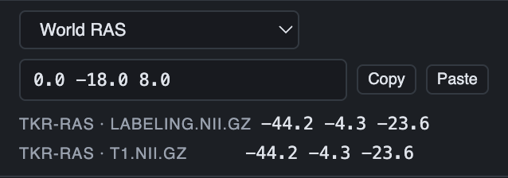

The **info panel** near the coordinate bar has two blocks with the same rows: `Cursor` (the last click, it
stays) and `Mouse` (live). Each names its layer and gives the voxel index and value, the region name, or the
element id, tissue tag and every field value at that point.

## Volume layers

One row per volume layer, bottom to top, each with an eye, an opacity slider and a disclosure triangle for
its editor. The active layer has an accent border and is what `Shift+drag`, right-drag and the keyboard act
on; `[` / `]` cycle which layer is active, `v` toggles its visibility, `Ctrl+↑/↓` reorders it.

Each volume layer has a colormap and a negative-branch colormap, `linear` or `heat` scaling, a threshold with
a soft edge, and nearest/linear interpolation. The **histogram** under the controls has draggable window and
threshold handles and presets (`min–max`, `2–98 %`, `p50–p99.9`, `symmetric ±p99`). This is the same control
whether the data is an MRI, a CT (where the presets stand in for the usual bone / soft-tissue / lung windows)
or a scalar field.

An overlay of a **simulated field** — tES (`TI_max`, a tDCS or tACS magnitude) or a TMS E-field — is an
ordinary volume layer on a `hot` scale with its threshold set from its own percentiles, drawn over the
anatomy with a colour bar.

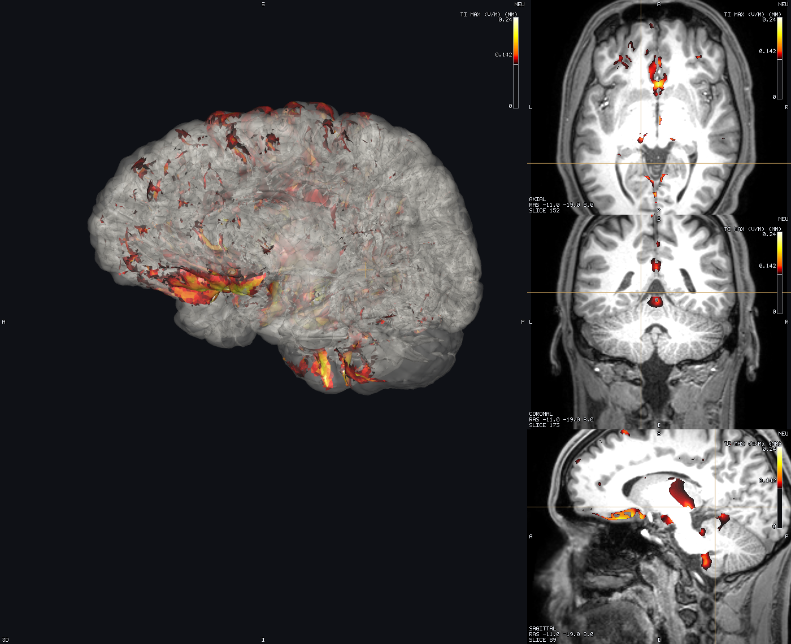

A label volume (an atlas or tissue map) gets fill / outline / both instead of a window — see [Atlases & regions]({{ site.baseurl }}/guide/atlases-regions.html).
A 4D volume gets a frame index you step with `,` / `.`.

**3D surface** turns a volume into isosurfaces in the 3D pane directly from its layer editor — one per
visible region for a label volume, in each region's own colour. For deriving an isosurface from a scalar
field on a mesh instead, see [Isosurfaces]({{ site.baseurl }}/guide/isosurfaces.html).

## Atlases & regions

A label volume (an atlas or a tissue segmentation) is loaded like any other volume, and reads its region
names and colours from a `<volume>_LUT.txt` sidecar when one sits beside it. In the volume layer's own
editor it can be drawn as **fill**, **outline**, or both instead of the usual window/level controls. An
anatomical atlas, a SimNIBS tissue segmentation and an organ or per-vertebra segmentation of a CT are all
the same kind of layer here.

  <figure>
    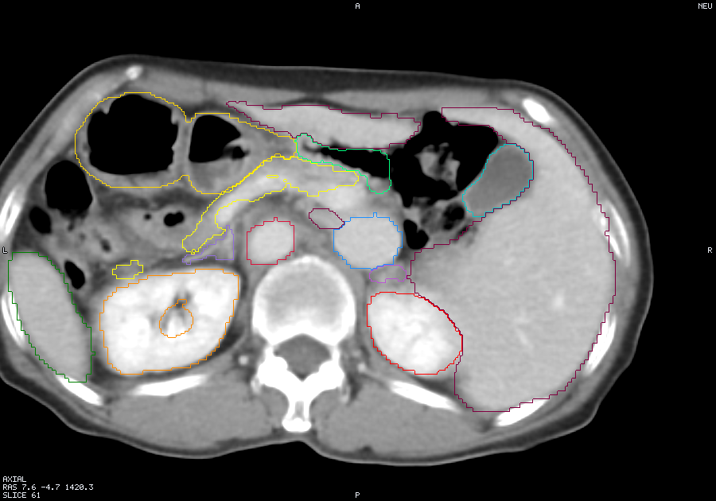
    <figcaption>Organ labels drawn as outlines over a CT</figcaption>
  </figure>
  <figure>
    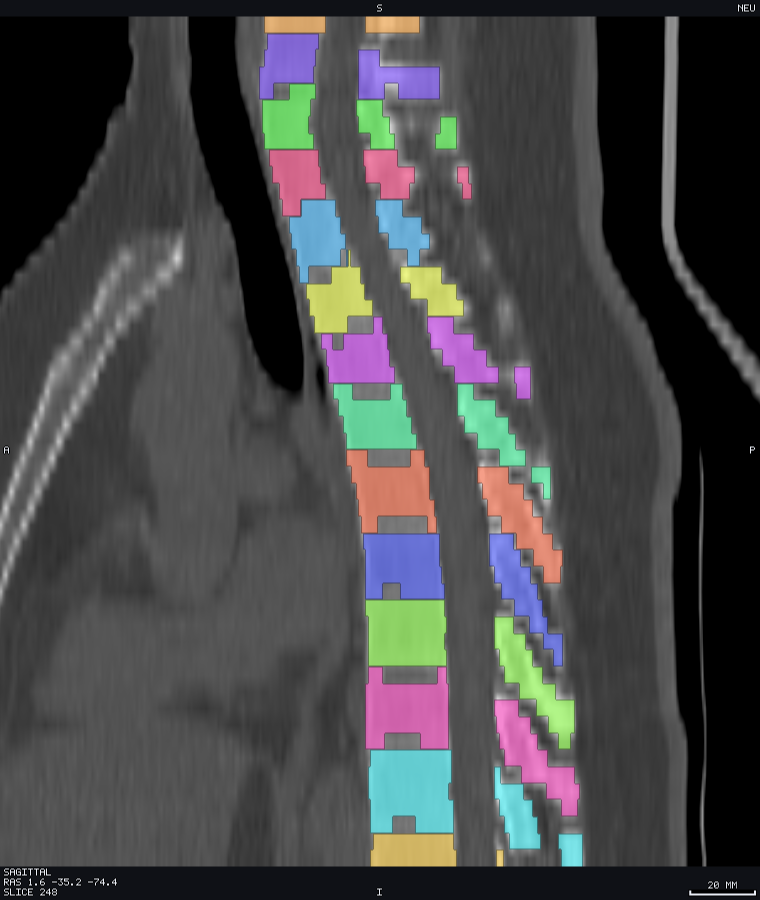
    <figcaption>Vertebra labels drawn as fill plus outline</figcaption>
  </figure>

The **region panel** lists everything labelled — atlas and tissue-map regions, mesh tissue tags, and surface
annotations — with the same rows: eye, colour swatch, name, id, count. Search as you type. Click to select
and emphasise, ⇧/⌘-click for several, **Alt-click to solo** (mute all others), and double-click to jump the
crosshair to that region's centroid. Show all / Hide all / Invert are at the top. Clicking a labelled voxel
or tissue in a pane selects its row.

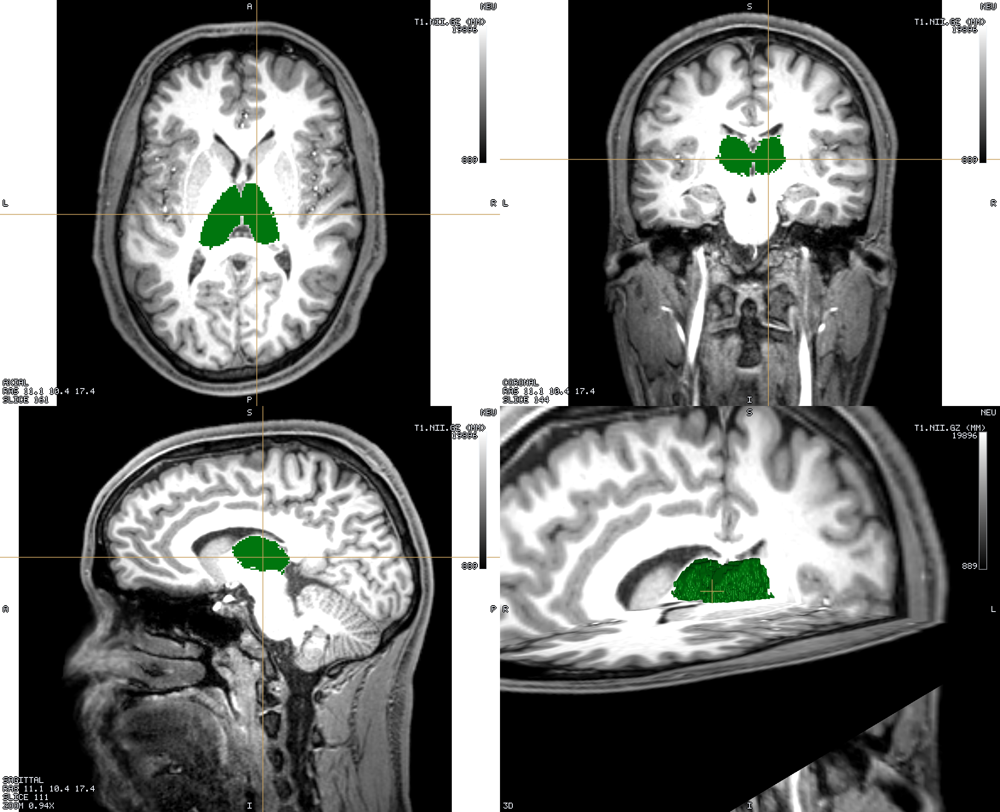

Colours you override and regions you hide are **saved in the scene**. Your edits sit on top of the file's own
table, so a per-row Reset restores the original, and *Save LUT…* writes the merged result out.

## Meshes

A tissue table (name, colour swatch, eye, opacity) rather than a list of checkboxes. Colour by tag, by a
solid colour, by a node or element field with a component selector, or by a `.annot` label.

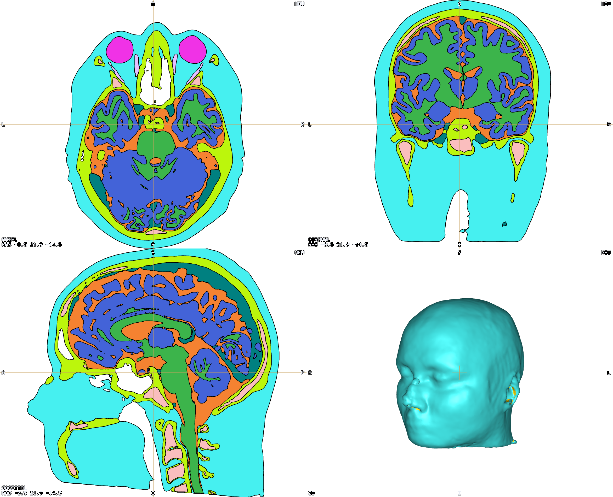

Per-tissue opacity is a real paint, not a global fade: one tissue can carry a field's colouring while the
others stay in their own fixed colours, so an outer surface can be made translucent without washing out what
it is covering.

  <figure>
    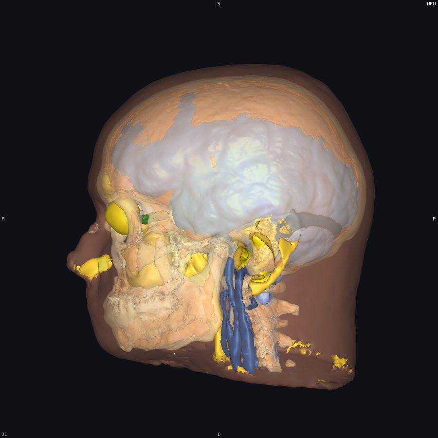
    <figcaption>Scalp and skull translucent over the brain</figcaption>
  </figure>
  <figure>
    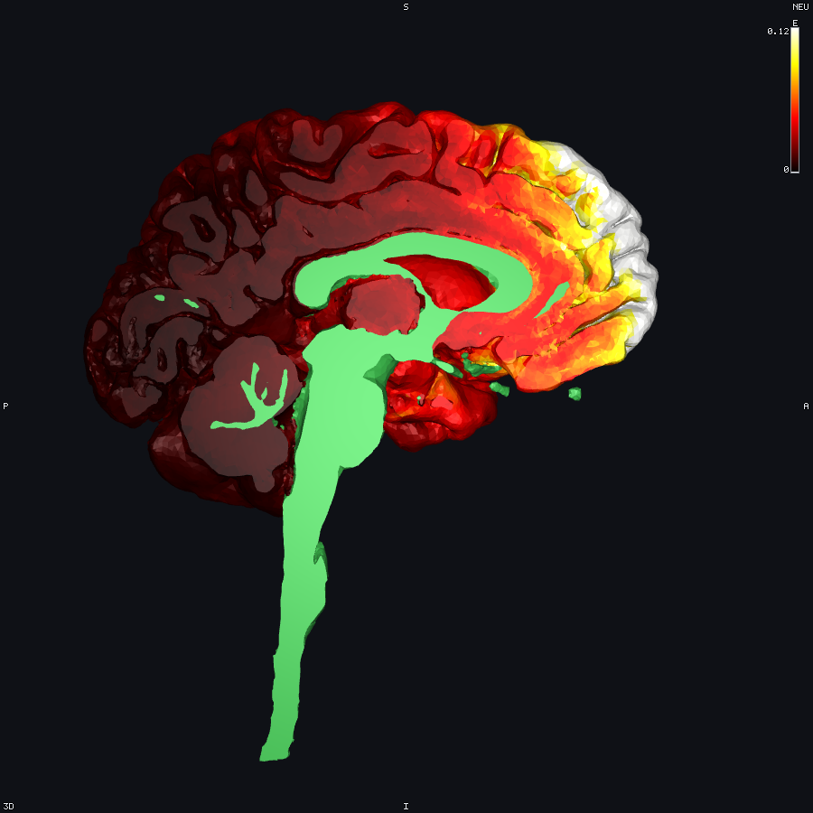
    <figcaption>One tissue coloured by a field, the rest fixed</figcaption>
  </figure>

**Element edges** draw the real element boundaries — including on cut caps — and stay visible while you
orbit. **Clip planes** — up to six, with a drag gizmo and a "follow cursor" option — cut the mesh and cap it
with exact per-element polygons rather than a hollow shell. **Isolation** keeps only the elements matching
tags, a field range, a sphere, a box, or the regions of a label volume.

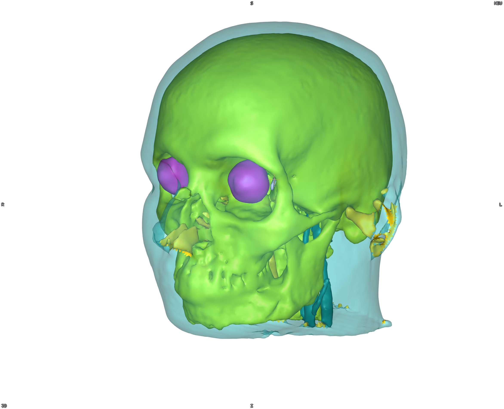

A scalar field carried by the mesh — `TI_max`, an `E` magnitude from a tDCS run, a TMS E-field — colours the
surface directly, with the colour bar reading that field's own units.

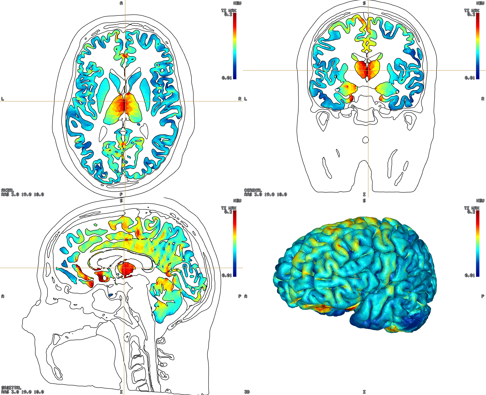

**In the 2D panes**, a tet mesh shows its cross-section — filled tissue polygons and boundary contours — and
it sweeps with the slice, with or without a volume loaded. See [Surfaces & annotations]({{ site.baseurl }}/guide/surfaces-annotations.html)
for how surface meshes appear in the 2D panes.

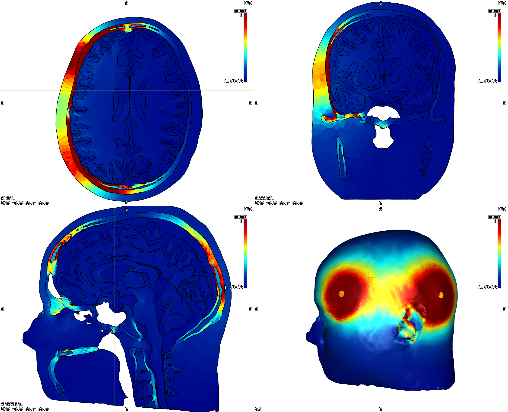

## Surfaces & annotations

A surface mesh (GIfTI, FreeSurfer, STL/PLY/OBJ, OFF, `.vtp`) draws its intersection with each 2D plane as a coloured
outline, Freeview-style, and sweeps with the slice. Clicking an outline selects that surface. In 3D it draws
as a shaded surface like any other mesh layer.

A FreeSurfer `.annot` file colours a surface by its own region labels rather than a field or a solid colour
— pick it from the same "colour by" control the tissue table uses for mesh layers, and its regions appear in
the [region panel]({{ site.baseurl }}/guide/atlases-regions.html) alongside atlases and tissue tags.

  <figure>
    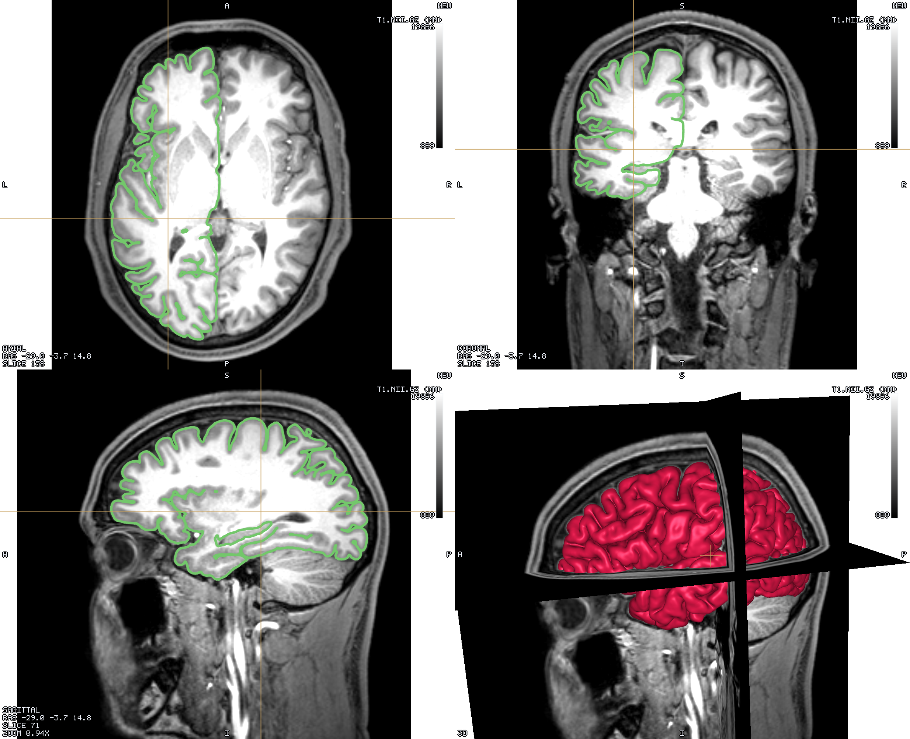
    <figcaption>The left pial surface as contours in the slices and shaded in 3D</figcaption>
  </figure>
  <figure>
    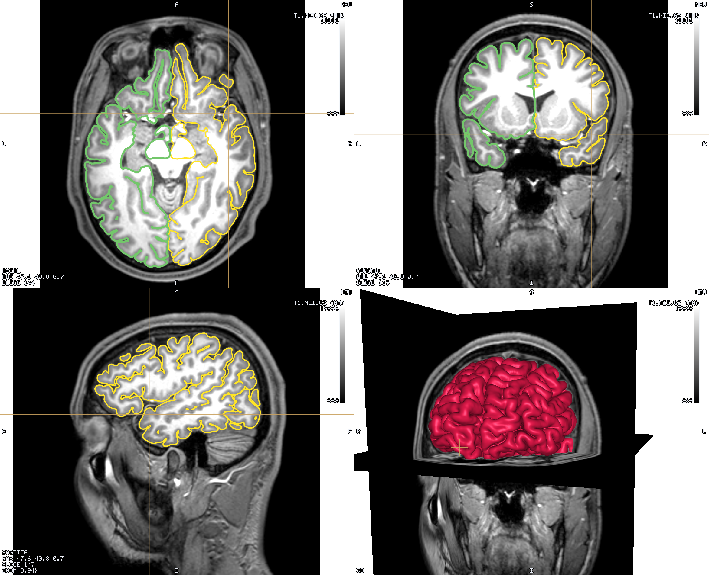
    <figcaption>Both pial surfaces, each contour in its own colour</figcaption>
  </figure>

## Isosurfaces

An isosurface layer extracts a level surface from a scalar source — a volume, or a scalar field on a mesh —
at an iso value you set with a slider ranged to that source's own data. Marching cubes runs on a volume,
marching tets on a mesh, so the mesh case gets an exact surface rather than a resampled approximation.
Controls: source, iso level, colour, opacity, smoothing, and flat vs. smooth face shading. A label volume
gives one isosurface per visible region, in that region's own colour — brain structures, or the organs of an
abdominal CT.

  <figure>
    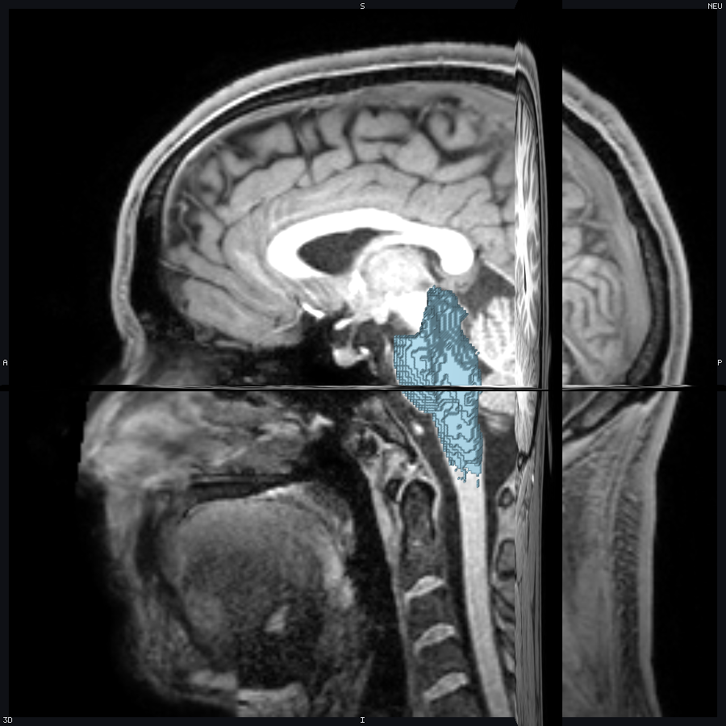
    <figcaption>A brainstem label as an isosurface</figcaption>
  </figure>
  <figure>
    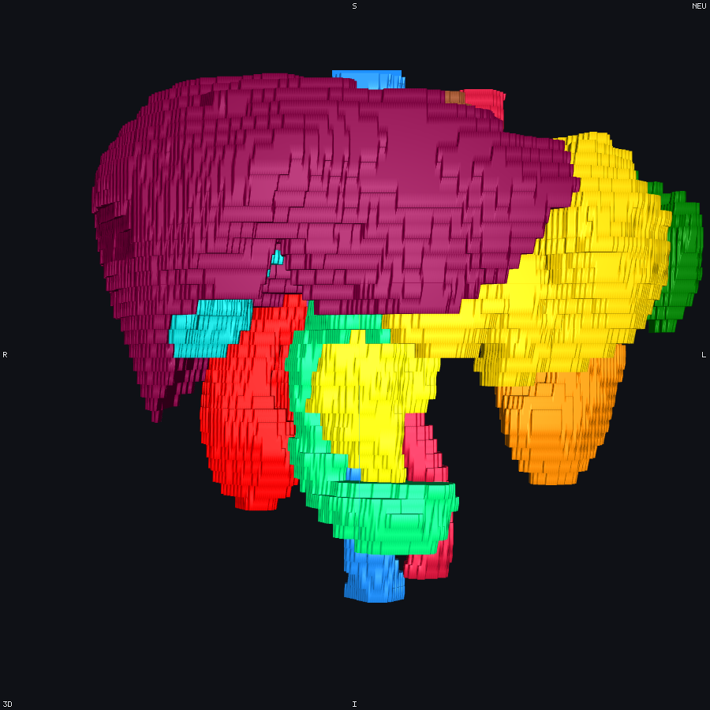
    <figcaption>Abdominal organ labels as isosurfaces</figcaption>
  </figure>

## Vector fields

A mesh layer with a vector field (for example a SimNIBS `E` field, three components per node or element) can
draw it as **glyphs** — arrows at each mesh vertex/element centroid or at each tetrahedron's centroid,
scaled by `fixed`, `linear`, `sqrt`, or `log` length scaling. The legend line under the colour bar states the
scaling as a full sentence, so the arrows' lengths mean something specific rather than an unlabelled scale. A
scalar field (no direction) never appears in the glyph selector — only fields with more than one component
can drive an arrow.

  <figure>
    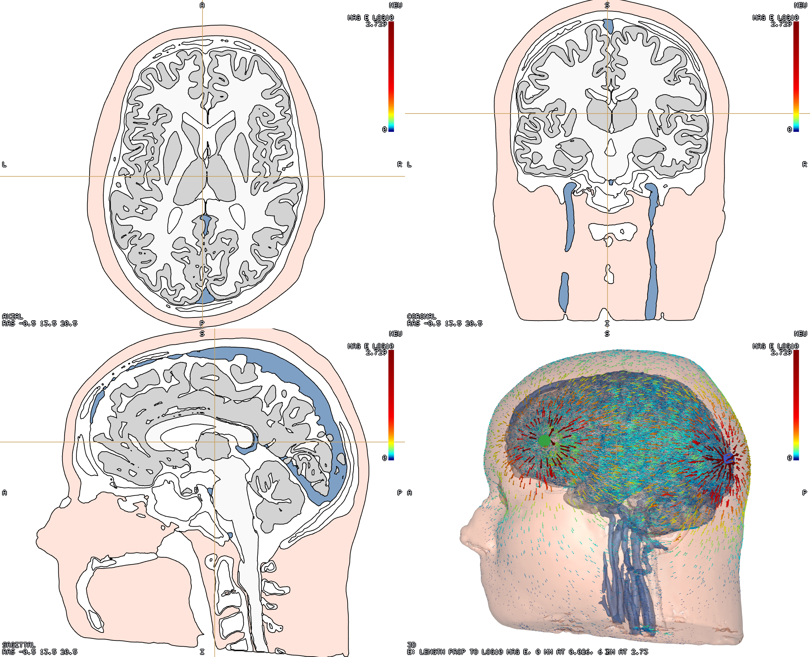
    <figcaption>Vector-field glyphs drawn as arrows in the 3D pane of a 2x2</figcaption>
  </figure>
  <figure>
    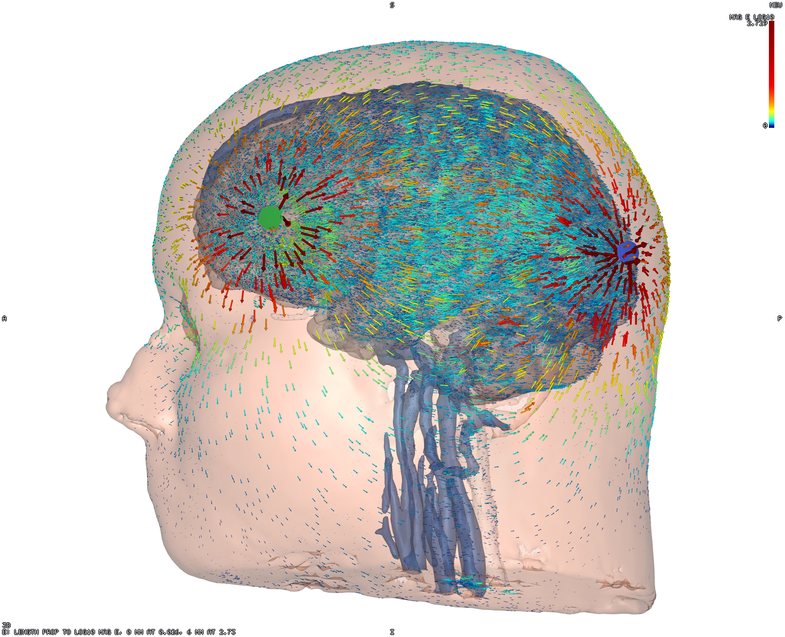
    <figcaption>The same glyphs filling a single 3D pane</figcaption>
  </figure>

## Points & electrodes

A points layer holds electrodes, ROI spheres, or any other set of labelled 3D locations — read from a
parsed Gmsh view (`.geo`/`.pos`, e.g. a SimNIBS EEG net) or a CSV of positions such as
`eeg_positions/*.csv`. Its editor sets a shared shape (sphere or dot), radius in millimetres, colour and
opacity, and whether labels are drawn; a searchable list below shows every point with a jump-to-cursor
button and a per-point colour/radius override (with a reset back to the layer default). When the source
carries per-point values (a parsed Gmsh view with data attached), the layer can colour by value instead of a
solid colour, with the same colormap choices as mesh field colouring, and a label-size control appears for
sources that actually have labels to size.

**A points layer a [module]({{ site.baseurl }}/guide/modules.html) owns is different**, and the layer panel says so: it shows a read-only
summary where that editor would be, and the module's own panel is the only way to change it. Contacts read
from an electrodes table belong to the [sEEG contacts]({{ site.baseurl }}/guide/seeg-contacts.html) module — its editor is where they are
placed, snapped, re-fitted, renumbered and saved, because the core editor here would rewrite the electrode
colours and the radius it is not allowed to touch, and its edits would go around the module's own undo. What
stays on the row is what belongs to the panel: visibility, opacity and the stacking order.

  <figure>
    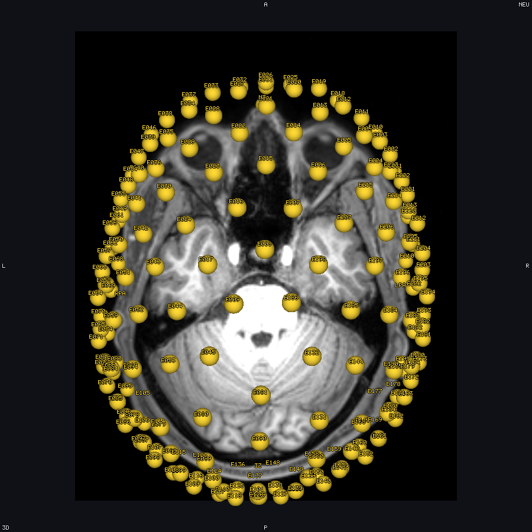
    <figcaption>An EEG net as labelled points in 3D</figcaption>
  </figure>
  <figure>
    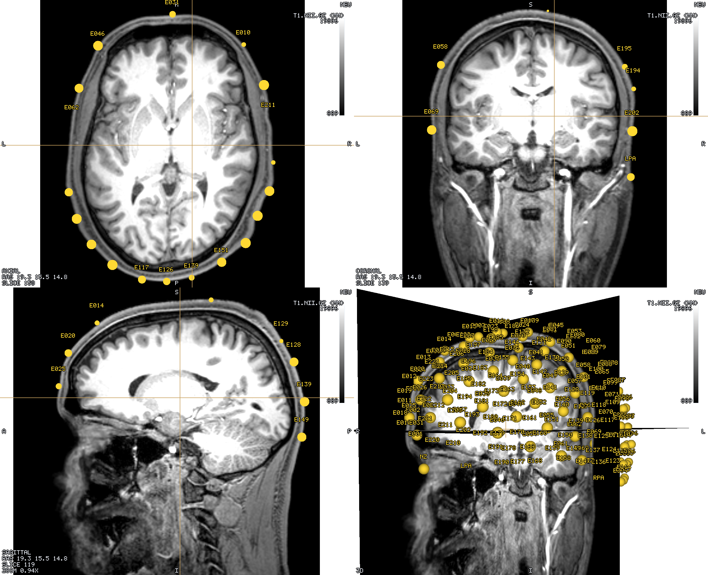
    <figcaption>The same net on the slices it touches, and over the head in 3D</figcaption>
  </figure>

## Measurements

Press `m` or the toolbar's measure button. Then:

1. click a point — in a 2D pane it lands on that plane; in 3D it lands on the surface you clicked;
2. click a second — you have a **distance** in millimetres;
3. click a third — the same measurement becomes an **angle** about the second point.

A fourth click starts a new one. `Esc` drops whatever is half-placed and leaves what is finished.

Lengths are world millimetres, so they are the same number at any zoom and in either convention. Each
measurement is drawn in every pane that actually contains its points, listed in the measurements panel with
a jump-to and a delete, and saved with the scene.

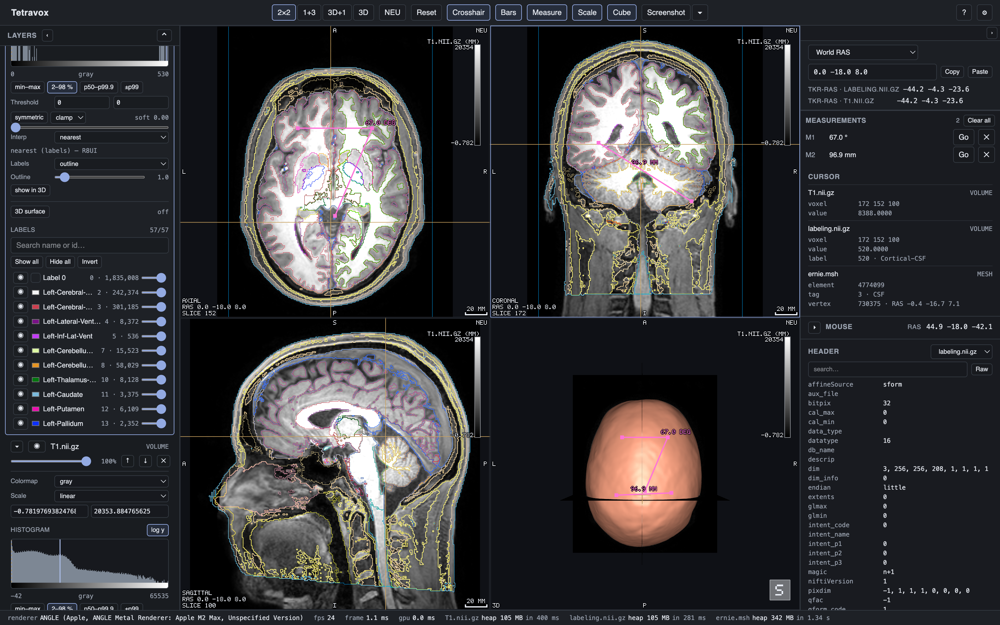

## Modules

A **module** is a first-party tool that Tetravox ships with, bigger than a toolbar toggle and smaller
than a second application — an editor for one kind of data, with its own panel, its own keys and its
own file formats. One module is active at a time.

**The switcher** is the `▾` button in the toolbar's right cluster, beside `?` and `⚙`. It lists every
module this build carries; picking one opens its panel, picking it again closes it. The panel itself is
the **module slot**: a section in the right column, above the Info panel, so the crosshair read-out
stays visible while you work — that is the feedback most module actions are judged by. The slot never
takes more than a bit over half the column and scrolls inside itself; with no module active it is not
there at all.

Below about 1000 px the sidebars normally collapse into overlays that close on the next click in a
pane. While a module is active the right sidebar stays **in flow** instead, because a module asks you
to click in the panes and an editor that closed itself on the first click would be unusable.

**Keys.** A module may bind `a s d f g n p t z Delete Backspace`, on their own or with Shift, and only
while it is active. They resolve **after** the ordinary key map, so no module can shadow `r`, `x`, `c`,
`v`, `m`, the camera presets or anything else in this guide, and `Esc` is never a module key. The
toolbar's `?` sheet grows a **Modules** tab listing the active module's chords.

**A module's status** — how many things it holds, what mode it is in — is one cell at the left of the
status bar, before the dataset cells.

**Unsaved edits.** A module's own edits are separate from the scene's. While one has unsaved work the
window title carries the same `•` a dirty scene does, and **New**, opening a scene, dropping a scene on
the window and closing a dataset all ask first, offering *Save…*, *Discard* and *Cancel*. `⌘S` saves the
**scene**; when a module still has unsaved work it says so rather than letting you believe otherwise —
a module saves its own files from its own panel.

**Scenes carry modules.** What a module needs to reopen — never a copy of the data, just its own small
record — is written into the `*.tetravox.json` under the module's id, and read back when the scene is
opened. A scene written by a build that has a module you do not is not damaged by opening and re-saving
it here: the block is carried through untouched.

**Layers a module owns** are marked in the layer panel and show a read-only summary instead of the usual
editor, so the module's own controls stay the only way to change them; closing such a layer's dataset
closes the module's layers with it.

## sEEG contacts

The **sEEG contacts** module is a contact editor for stereo-EEG depth electrodes: open a registered CT
and the BIDS `electrodes.tsv` that was localised on it, fix what the localiser got wrong, and write the
table back — reversibly, with a backup and a provenance sidecar. It reproduces the 3D Slicer *SEEG
Contact Editor* workflow (`seegprep`'s `slicer/SEEGContactEditor`) in Tetravox's own panes, and reads
and writes the same files, so the two can be used on the same subject interchangeably.

Open it from the toolbar's module switcher (`▾`, right of the panes), or just open one of the files.

### Opening a subject

Drop, or **Open…**, either of these and the module finds the other beside it:

| File | Where |
|---|---|
| the registered CT | `derivatives/seegprep/sub-<id>/ct/sub-<id>_acq-bone_space-T1w_ct.nii.gz` |
| the electrodes table | `derivatives/seegprep/sub-<id>/ieeg/sub-<id>_space-T1w_electrodes.tsv` |

From the CT it also looks for the `_coordsystem.json`, an existing `_editlog.json`, and the subject's
T1 at `derivatives/SimNIBS/sub-<id>/m2m_<id>/T1.nii.gz`. Nothing is searched for: the module knows those
four names and asks whether each one exists.

Opening the **table first** is fine — it is read and held until a volume arrives, and the panel says so.
The CT has to be open for anything that needs image intensities (that is Snap), because a module reads
the volume through the app rather than opening files itself.

The reader is deliberately forgiving. It detects tab, comma, semicolon or whitespace; strips a UTF-8
BOM; matches column names case-insensitively (`name`/`label`, `x`/`pos_x`/`x_mm`, or `R`/`A`/`S`);
takes the electrode from `electrode`, `group`, `shaft` or `lead`, or infers it by stripping the trailing
digits off the contact name (`LHIP8` → `LHIP`); and truncates a ragged row rather than refusing the file.
A 3D Slicer `.fcsv` markups file works too, LPS coordinates and all. A missing required column is the one
thing it refuses, and the message names the delimiter it detected and the columns it found.

On load the CT is set the way the Slicer editor sets it — grey, fully opaque, and everything below
**150 HU hidden**, so soft tissue drops away and bone and metal are what is left. Colormap, opacity and
the intensity floor stay in the ordinary volume-layer editor on the left; the module sets them once and
then leaves them to you. If a T1 is loaded above the CT in the layer list, raise the CT above it — the
floor only reveals what is underneath.

If an `_editlog.json` already sits beside the table, the panel shows a banner saying when it was
hand-edited: somebody has been here before you.

### Editing

The contacts are one points layer named `Contacts · <table stem>`, one dot per contact, coloured by
electrode, labelled with its name, with the shaft drawn as a line between consecutive contacts. Contacts
that are not on the current slice are drawn as **ghosts** at 0.6 opacity so a shaft reads as a shaft
while you scroll; `g` turns that off and on.

| Do this | With |
|---|---|
| select a contact | click it in a pane, or click its row in the list |
| move one | drag it in a 2D pane |
| add contacts | **Add** (`a`) — then every click in a pane drops a new contact on the chosen electrode |
| walk the electrode | `n` / `p`, or the list — the crosshair follows, so every pane slices through the contact |
| snap to the metal | `s` for the selected contact, `⇧S` for the whole electrode, **Snap all…** for every one |
| re-fit the shaft | `f` |
| renumber from the tip | **Renumber tip-first** |
| flip which end is the tip | `t` |
| delete | `Delete` or `⌫` |
| undo / redo | `z` / `⇧Z` |

**Snap** moves a contact to the intensity-weighted peak of a small box around it — the metal it is
inside — at the radius the panel's field sets (0.5–5 mm, 1.5 mm by default). A contact with nothing
bright near it does not move and is not counted. *Snap all* asks first, because it touches every
electrode at once; one snap of any scope is a single undo step.

**Re-fit shaft** fits a line through the electrode's contacts, projects them onto it, re-spaces them
evenly at the *median* observed gap — median, so one missing contact does not stretch the rest — and
relabels them from the tip. It reports the line RMS and the spacing CV, which are the two numbers that
say whether the shaft is straight and evenly spaced.

**Numbering only ever changes when you ask.** Loading, placing, dragging, snapping and deleting all leave
every contact's number and name exactly as they were — a clinical table's numbering is wired to the
recording system through its `csc` column, and nothing should renumber it behind your back. Only
*Re-fit* and *Renumber tip-first* relabel, and both say so on the button. New names keep the zero-padding
the file used (`LINS01`, not `LINS1`).

**Which end is the tip** is a heuristic, and the panel shows the answer: *contact 1 is the end of the
shaft nearer the centre of the volume*, and the other end is the entry. That is right for nearly every
depth electrode and wrong for some — a shaft entering near the midline can defeat it — so the tip
contact is marked in the list and `t` flips it. A flip is remembered per electrode and saved with the
scene.

### Saving

**Save** writes the table back over the file it came from; **Save as…** picks a new one. Either way three
things happen, in this order:

1. the previous table is copied to `<name>.<YYYYMMDD-HHMMSS>.bak`;
2. the table is written — tab-separated, LF, **your original columns in their original order**, with
   `electrode`, `contact` and `status` appended if they were not already there. `status` is `kept`,
   `edited` (moved by more than 0.001 mm) or `added`; a row that has not moved keeps whatever status the
   localiser gave it, so `located` and `gapfilled` survive;
3. `<stem>_editlog.json` is written beside it, recording what changed — counts, and one entry per
   contact added, moved, **renamed** or deleted, with where it was and where it is now. Renumber and
   Re-fit relabel contacts that may not have moved at all, and those entries carry the name the table
   had (`renamed_from`) beside the name it has now: relabelling is the one edit that changes how the
   `csc` column maps onto your recording system, so an editlog silent about it would be lying.

That editlog name matters: `seegprep` looks for `*_electrodes_editlog.json` in the subject's `ieeg/`
directory and **refuses to re-run over a hand-edited subject unless you pass `--force`**. If you save
under a name whose stem does not end in `_electrodes`, or outside an `ieeg/` directory, the module warns
you that the guard will not see it.

**Revert to loaded positions** puts every contact back where the file had it and forgets the additions,
which is the in-session undo of everything; the `.bak` is the on-disk one.

⌘S saves the **scene**, not the table. When contacts are unsaved the module says so, the window title
carries a `•`, and closing the window, starting a new scene, opening another one or closing the CT all
ask first.

### Scenes, and a build without the module

The contacts are ordinary scene layers, so a `*.tetravox.json` written here opens anywhere — including
in a build that has no sEEG module, which still draws every contact with its name, its electrode and its
number. What that build cannot carry is the module's own record: which table the contacts came from,
where that table put each one, and its other columns. Re-open such a scene here and the module rebuilds
the electrodes from the layer, tells you the provenance is gone, and turns Save into Save as… rather than
writing a table in which everything looks new.

### From a job file

Every button is also a job-file operation, so a batch can do what the panel does — `load`, `snap`,
`refit`, `renumber`, `ghost`, `stats` and `save`. See [Automation]({{ site.baseurl }}/AUTOMATION.html).

## Coordinates

The **coordinate bar** shows the crosshair and lets you type one in. The space selector offers World RAS,
per-volume voxel and tkr-RAS, and — when a SimNIBS `toMNI/` folder sits beside the subject — MNI152 as two
separate entries, **affine** and **nonlinear**, because they are two different numbers. A surface adds its
own vertex index, and fsaverage vertex read-out turns on once a FreeSurfer subjects directory is set in
[Settings]({{ site.baseurl }}/guide/themes-settings.html). A space that cannot be used is listed and disabled with the reason on it rather
than hidden. Copy yields the triple in the space you selected; Enter converts it back.

## Themes & settings

**System / Light / Dark** under `⚙` Settings, remembered between launches and applied with no reload. `Sys` follows
the operating system live. **The view panes stay dark in both themes** — that is deliberate, not an
oversight: a light viewport changes what a greyscale T1 and a heat overlay look like, and the chrome drawn
over the image (letters, crosshair, colour-bar text) takes its palette from the pane rather than from the
theme name, so its halo inverts to stay legible.

  <figure>
    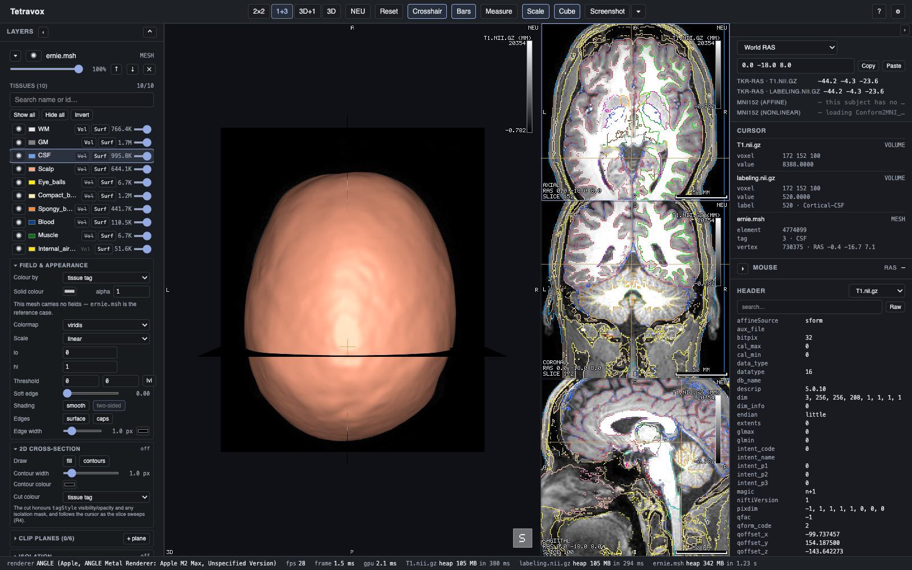
    <figcaption>The window in the dark theme</figcaption>
  </figure>
  <figure>
    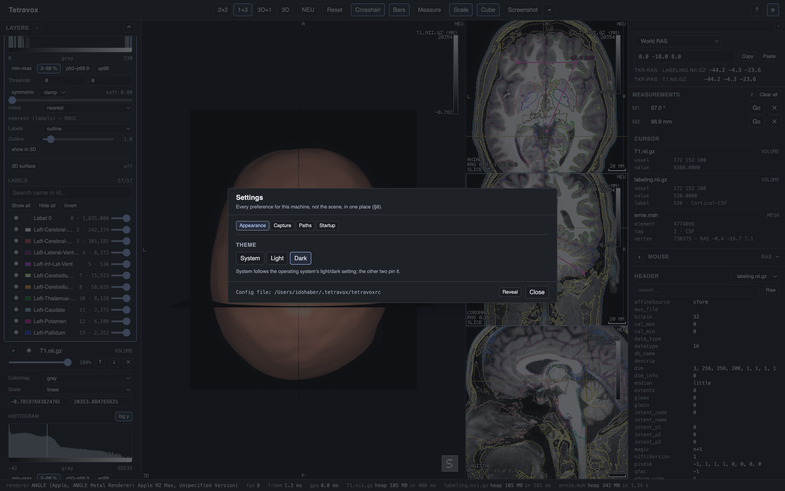
    <figcaption>The Settings dialog</figcaption>
  </figure>

`⚙` in the toolbar opens Settings. These are preferences for the *machine*, not for the scene: the
**FreeSurfer subjects directory** (which is what turns on the fsaverage vertex read-out for surfaces) and
**reopen last scene on launch**.

## Scenes

A **scene** is one file — `something.tetravox.json` — that remembers what you were looking at: which files
were open, how every layer was set up, the crosshair, the panes on screen, each camera, your region edits,
your measurements and the theme. It is a few kilobytes of readable JSON and does **not** contain your data;
it points at the files on disk.

| | |
|---|---|
| **⌘S / Ctrl+S** | Save. A sheet the first time, then the same file with no dialog |
| **⇧⌘S / Ctrl+Shift+S** | Save As… |
| **⌘O**, a drop, **File ▸ Open Recent**, or a double-click in the file manager | Open one |

The first Save sheet opens **beside your data**, offering `<the first dataset's folder>/<its name>.tetravox.json`.
The title bar tells you where you stand: a bare `Tetravox` means nothing open or nothing changed, a `•` means
unsaved changes, and a name means a scene file. The `•` is deliberately eager — it appears for anything that
*could* have changed the scene, including a camera you moved and put back. Saving again costs a keystroke;
not being told costs the work.

Opening a scene **replaces** what is on screen. Dropping a scene and three volumes at once is the one thing
not to do: the scene wins and the volumes land on top of it.

**When the data has moved,** Tetravox looks in three places in order — the path recorded relative to the
scene file (which is what makes "copy the whole folder" work), the absolute path it had when saved, and the
file's own name next to the scene. If a file is in none of them the **Locate** dialog lists what is missing,
what was tried, and the fingerprint recorded for each; point it at the file and confirm. Nothing loads until
you have answered, because half a scene with the wrong files in it is worse than no scene. You can **Skip** a
file — its layers are left out and the rest opens.

The fingerprint (`tvxfp1-…`) identifies a file by its length and a digest of three windows of its bytes. It
tells you whether the file you are pointing at is the one the scene was built on. It is not a security check,
and it will not notice an edit deep inside a large file that missed all three windows.

Two things to know if you edit a scene by hand: a threshold with no bound is written as `null`, not
`Infinity` (JSON has no infinity), and `version` is `2` — files written by older builds say `1` and are
upgraded on load, while a version this build does not know is refused rather than guessed at.

**Reopen last scene on launch** is off by default, in Settings ▸ Scenes. It is off because reopening a scene
reloads every file in it and a head mesh can be well over 100 MB. A file named on launch always wins over the
remembered scene.

## Screenshots & video

The toolbar's screenshot button saves one pane or the whole grid as a PNG, at a size or scale you choose,
with the DPI written into the file so it drops into a manuscript at the right physical size. Choose which
chrome to include — colour bar, orientation letters, crosshair, corner info, scale bar, cube — and whether
the background is the scene's, white, black, or transparent. The **figure** presets go further: a labelled
multi-panel export on white, sized in millimetres at the DPI a journal asks for.

For a batch of figures, or a video, drive the app from a script instead: it runs with no window and never
takes the focus, so a sweep through 200 slices can render while you work. See
[Automation & Python]({{ site.baseurl }}/AUTOMATION.html) and the Python client in [`python/`](../python).

## Keyboard shortcuts

Every shortcut is suppressed while a text field has focus. The toolbar's **?** button shows this list in
the app, grouped in tabs by what each binding acts on.

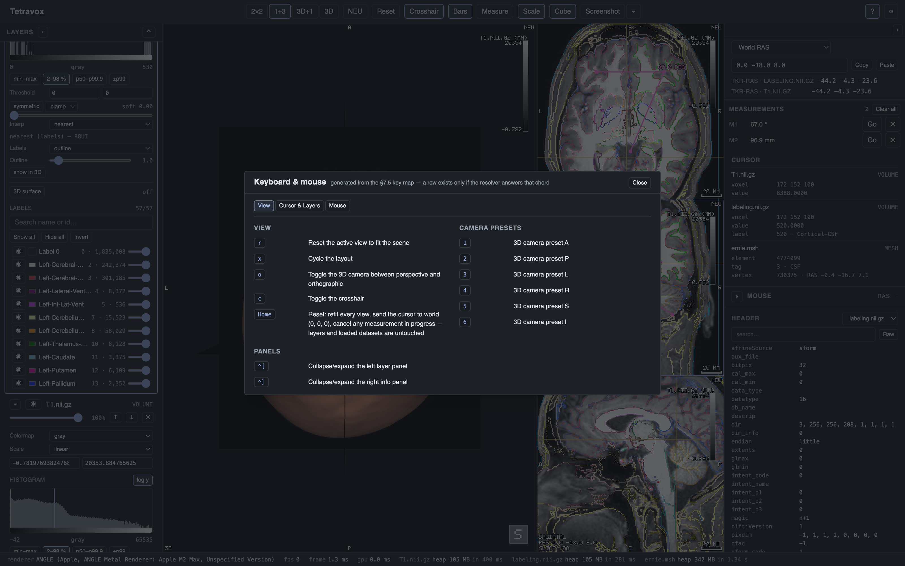

**Layout, camera and layers**

| Key | Action |
|---|---|
| `r` | Reset the active view |
| `1`–`6` | Camera preset A / P / L / R / S / I |
| `x` | Cycle the pane layout |
| `o` | Toggle orthographic projection (3D pane) |
| `c` | Toggle the crosshair |
| `[` / `]` | Cycle the active layer |
| `v` | Toggle the active layer's visibility |
| `Ctrl+↑` / `Ctrl+↓` (or `⌘↑`/`⌘↓`) | Reorder the active layer |
| `,` / `.` | Step the active volume layer's 4D frame |
| `Ctrl+[` / `Ctrl+]` (or `⌘[`/`⌘]`) | Collapse/expand the left / right sidebar |
| `Home` | Reset every pane, cursor to world origin, cancel any in-progress measurement |

**Cursor and slices**

| Key | Action |
|---|---|
| `↑` `↓` `←` `→` | Nudge the cursor in the pane's plane |
| `PgUp` / `PgDn` | Step one slice along the pane's normal |

**Measuring**

| Key | Action |
|---|---|
| `m` | Toggle measure mode |
| `Esc` | Cancel the measurement being placed |

**Pointer gestures** (not keys, but part of the same map)

| Gesture | Action |
|---|---|
| Left-click / drag, 2D pane | Move the crosshair |
| Wheel, 2D pane | Step one slice |
| `⌘`/`Ctrl` + wheel, or pinch | Zoom about the pointer |
| `+` / `-` | Zoom about the pane centre |
| Middle-drag, `Space`+drag, or two-finger drag | Pan |
| Right-drag | Window / level the active layer |
| `Shift`+drag | The active layer's opacity |
| 3D: left-drag / right-drag / wheel | Orbit / pan / dolly |
| 3D: double-click | Put the crosshair on what you clicked |

**Oblique planes**

Drag the gizmo ring handles to rotate the plane; drag its stem to slide it along the normal. Plane-from-3-points
takes the next three clicks in any 2D pane. A camera preset puts the pane back on axial / coronal / sagittal.

**Module keys** are not in this table, and that is deliberate: `a s d f g n p t z Delete Backspace` are
lent to whichever [module](#modules) is open and mean nothing when none is. They are resolved **after**
everything above, so no module can change what any key on this page does, and `Esc` is never one of them.
The `?` sheet grows a **Modules** tab listing the active module's own chords. The
[sEEG contacts]({{ site.baseurl }}/guide/seeg-contacts.html) module binds these:

| Key | Action |
|---|---|
| `a` | Add contacts (place mode) |
| `s` | Snap the selected contact to the metal |
| `⇧S` | Snap the whole electrode |
| `n` / `p` | Next / previous contact |
| `f` | Re-fit the shaft |
| `t` | Flip which end is the tip |
| `g` | Contacts visible through slices |
| `Delete` / `⌫` | Delete the selected contact |
| `z` / `⇧Z` | Undo / redo |

`⌘O` / `Ctrl+O` (Open…) is bound in the Electron application menu, not in this map, so it is never double-bound.

## Troubleshooting

* **"No WebGL2 context"** — the app checks for a working WebGL2 context at startup and shows this screen
  instead of a blank window when `getContext('webgl2')` returns `null`. Update your GPU drivers, or check
  `chrome://gpu` for what was blocklisted.
* **A black or empty 3D view with a mesh loaded** — the mesh may have no surface triangles of its own
  (SimNIBS `grey_*.msh` files have none). Tetravox extracts the boundary for you; if it is still empty,
  check the tissue table for everything switched off.
* **"Reduced precision" in the status bar** — your GPU lacks `EXT_texture_norm16`, so a 16-bit volume is
  being displayed through an 8-bit texture. Values you probe are unaffected: they are read from the original
  samples, not from the texture.
* **A slow, software renderer** — the status bar names the renderer. `chrome://gpu` in any Chromium says why
  the GPU was refused.
* **The window opens black on a light theme** — please report it; the background colour is meant to be read
  from your saved theme before the first frame.
* **A large mesh is slow to load or the app feels sluggish** — a head mesh can be well over 100 MB; loading
  and re-loading it (for example via "reopen last scene on launch") costs real time and memory. Keep that
  setting off unless you want it, and prefer opening one heavy dataset at a time when memory is tight.
* **macOS refuses to open the app ("Tetravox is damaged and can't be opened")** — the official releases are
  signed and notarised and open directly; this is Gatekeeper's message for an **unsigned local build**
  (`pnpm package` without a certificate), not a corrupted download. `xattr -dr com.apple.quarantine
  /Applications/Tetravox.app` clears it once.
  Clear the quarantine attribute: `xattr -dr com.apple.quarantine /Applications/Tetravox.app`.
* **A scene won't fully load — "Locate" dialog appears** — Tetravox couldn't find one or more files at any
  of the three places it checks (path relative to the scene, the absolute path it had when saved, or the
  file's own name next to the scene file). Point Locate at the real file, or Skip it to open the rest of the
  scene without it.
