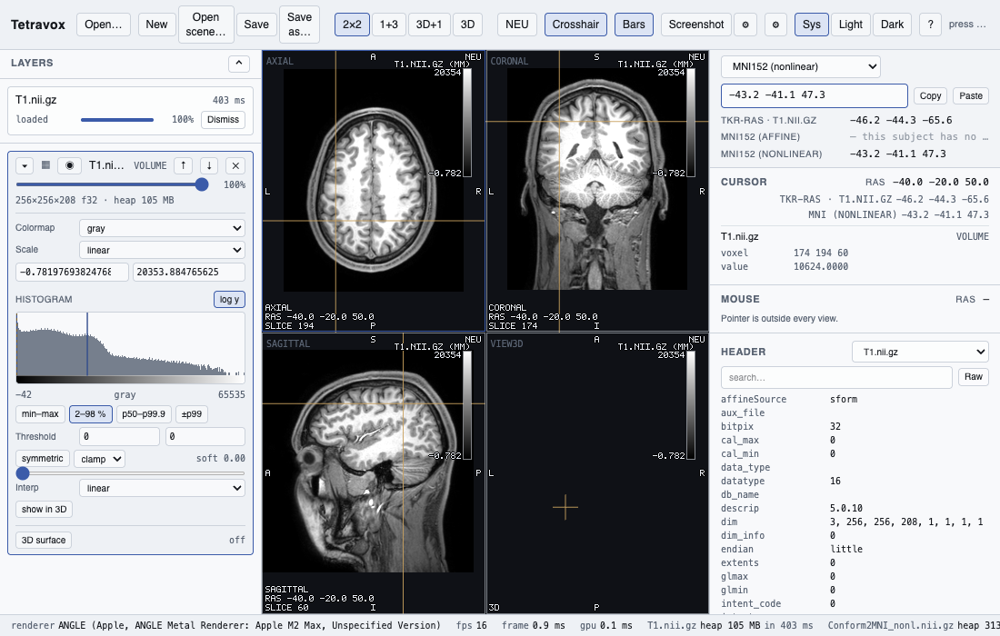
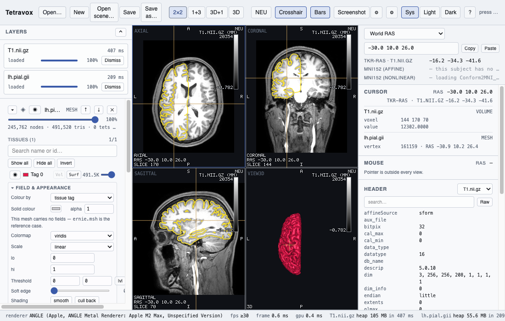
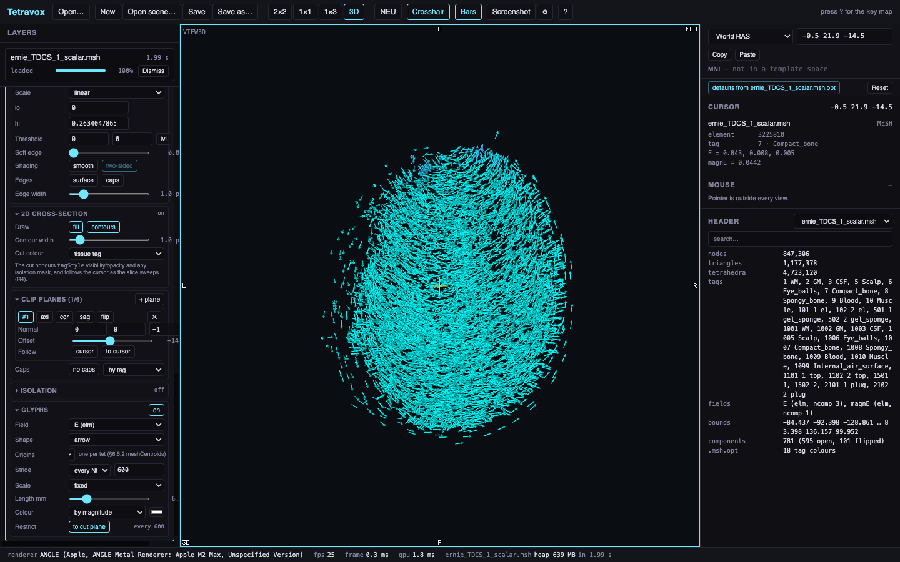
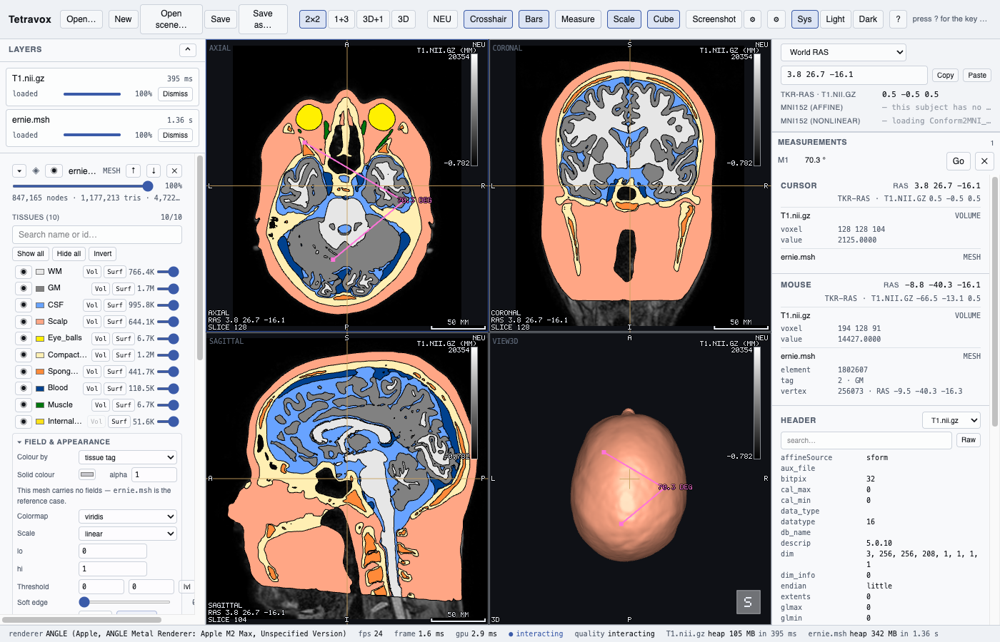
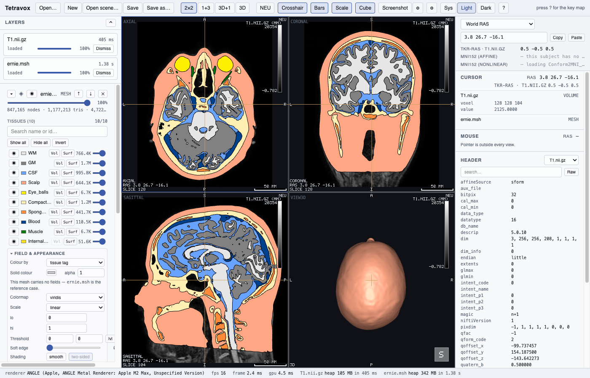
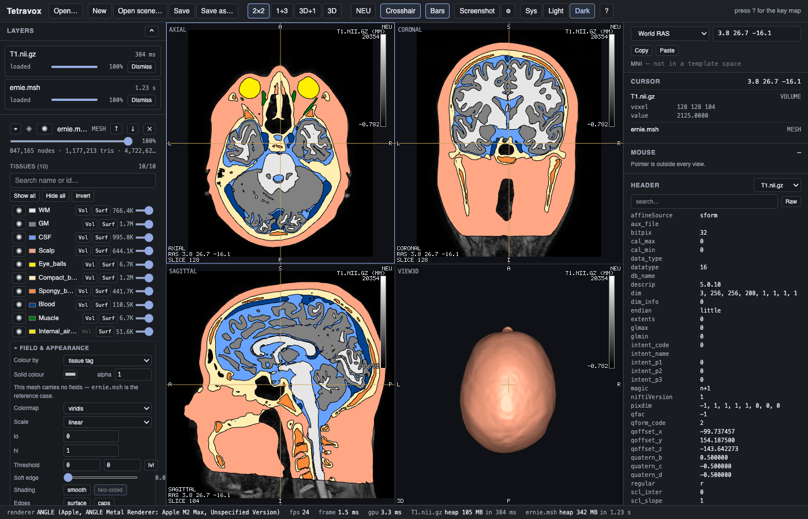

# Tetravox — user guide

A viewer for **voxel volumes** (NIfTI) and **finite-element / surface meshes** (Gmsh `.msh`, GIfTI,
FreeSurfer, STL/PLY/OBJ), with a 3D view and sagittal / axial / coronal slices that all follow one crosshair.
This guide is split by topic; for install and dev-build instructions see the website's
[Get started](https://tetravox.dev/get-started) page or this repo's `README.md`.

## Opening data & formats

Any of: drag files onto the window, **⌘O / Ctrl+O**, File ▸ Open…, or name them on the command line
(`Tetravox T1.nii.gz ernie.msh`). Opening data **adds** to what is on screen; opening a scene **replaces** it.

Formats read: NIfTI-1/2 (`.nii`, `.nii.gz`, including 4D), Gmsh `.msh` v2.2 and v4.1, Gmsh parsed views
(`.geo` / `.pos` — SimNIBS electrode nets), GIfTI (`.gii`, `.func.gii`, `.shape.gii`, `.label.gii`),
FreeSurfer surfaces / `curv` / `.annot`, STL, PLY, OBJ.

Sidecars beside a file are picked up automatically and matter more than they look:

| Sidecar | Gives you |
|---|---|
| `<mesh>.msh.opt` | tissue names (WM, GM, CSF …), their colours, and the field range to open at |
| `<volume>_LUT.txt` | region names and colours for an atlas or a tissue map |

`ernie.msh` has no `$PhysicalNames` section, so its `.msh.opt` is the *only* source of tissue names. Without
it the tissue table reads `tag 1`, `tag 2`, … and the head is drawn in a fallback palette.

## The panes

**The crosshair is one point in space** and every pane shows it. Move it and all the panes follow.

| | |
|---|---|
| **Left-click / drag** in a 2D pane | move the crosshair. It never pans the image |
| **Wheel** | step one slice |
| **⌘/Ctrl + wheel**, or a trackpad pinch | zoom about the pointer |
| **Middle-drag**, **Space + drag**, or a two-finger trackpad drag | pan |
| **Right-drag** | window / level on the active layer |
| **Shift + drag** | the active layer's opacity |
| **Arrows** | nudge the crosshair in the plane · **PgUp / PgDn** step slices |
| In the **3D pane**: left-drag orbits, right-drag pans, wheel dollies, **double-click** puts the crosshair on what you clicked | |

`x` cycles the pane layout (1+3, 2×2, single pane, …); `r` resets the active view, or Alt + double-click.
Zoom is per pane: `+` / `-` zoom about the pane centre.

Every 2D pane carries orientation letters on all four edges, a corner block (view, slice index, world RAS)
and a persistent **RAD** / **NEU** badge — the neurological/radiological convention is never implicit. The
**Scale** toggle adds a scale bar in millimetres, and **Cube** adds an orientation cube to the 3D pane whose
faces you can click to snap the camera (also `1`–`6` for A/P/L/R/S/I). Toggle the radiological convention
from the toolbar; it mirrors the image about the vertical axis and nothing else. `o` toggles orthographic
projection in the 3D pane, `c` toggles the crosshair, `Home` resets every pane and sends the cursor to world
origin.

The **info panel** near the coordinate bar has two blocks with the same rows: `Cursor` (the last click, it
stays) and `Mouse` (live). Each names its layer and gives the voxel index and value, the region name, or the
element id, tissue tag and every field value at that point.

## Volume layers

One row per volume layer, bottom to top, each with an eye, an opacity slider and a disclosure triangle for
its editor. The active layer has an accent border and is what `Shift+drag`, right-drag and the keyboard act
on; `[` / `]` cycle which layer is active, `v` toggles its visibility, `Ctrl+↑/↓` reorders it.

Each volume layer has a colormap and a negative-branch colormap, `linear` or `heat` scaling, a threshold with
a soft edge, and nearest/linear interpolation. The **histogram** under the controls has draggable window and
threshold handles and presets (`min–max`, `2–98 %`, `p50–p99.9`, `symmetric ±p99`). A label volume (an atlas
or tissue map) gets fill / outline / both instead of a window — see [Atlases & regions]({{ site.baseurl }}/guide/atlases-regions.html).
A 4D volume gets a frame index you step with `,` / `.`.

**3D surface** turns a volume into isosurfaces in the 3D pane directly from its layer editor — one per
visible region for a label volume, in each region's own colour. For deriving an isosurface from a scalar
field on a mesh instead, see [Isosurfaces]({{ site.baseurl }}/guide/isosurfaces.html).

## Atlases & regions

A label volume (an atlas or a tissue segmentation) is loaded like any other volume, and reads its region
names and colours from a `<volume>_LUT.txt` sidecar when one sits beside it. In the volume layer's own
editor it can be drawn as **fill**, **outline**, or both instead of the usual window/level controls.

The **region panel** lists everything labelled — atlas and tissue-map regions, mesh tissue tags, and surface
annotations — with the same rows: eye, colour swatch, name, id, count. Search as you type. Click to select
and emphasise, ⇧/⌘-click for several, **Alt-click to solo** (mute all others), and double-click to jump the
crosshair to that region's centroid. Show all / Hide all / Invert are at the top. Clicking a labelled voxel
or tissue in a pane selects its row.

Colours you override and regions you hide are **saved in the scene**. Your edits sit on top of the file's own
table, so a per-row Reset restores the original, and *Save LUT…* writes the merged result out.

## Meshes

A tissue table (name, colour swatch, eye, opacity) rather than a list of checkboxes. Colour by tag, by a
solid colour, by a node or element field with a component selector, or by a `.annot` label.

**Element edges** draw the real element boundaries — including on cut caps — and stay visible while you
orbit. **Clip planes** — up to six, with a drag gizmo and a "follow cursor" option — cut the mesh and cap it
with exact per-element polygons rather than a hollow shell. **Isolation** keeps only the elements matching
tags, a field range, a sphere, a box, or the regions of a label volume.

**In the 2D panes**, a tet mesh shows its cross-section — filled tissue polygons and boundary contours — and
it sweeps with the slice, with or without a volume loaded. See [Surfaces & annotations]({{ site.baseurl }}/guide/surfaces-annotations.html)
for how surface meshes appear in the 2D panes.

## Surfaces & annotations

A surface mesh (GIfTI, FreeSurfer, STL/PLY/OBJ) draws its intersection with each 2D plane as a coloured
outline, Freeview-style, and sweeps with the slice. Clicking an outline selects that surface. In 3D it draws
as a shaded surface like any other mesh layer.

A FreeSurfer `.annot` file colours a surface by its own region labels rather than a field or a solid colour
— pick it from the same "colour by" control the tissue table uses for mesh layers, and its regions appear in
the [region panel]({{ site.baseurl }}/guide/atlases-regions.html) alongside atlases and tissue tags.

## Isosurfaces

An isosurface layer extracts a level surface from a scalar source — a volume, or a scalar field on a mesh —
at an iso value you set with a slider ranged to that source's own data. Marching cubes runs on a volume,
marching tets on a mesh, so the mesh case gets an exact surface rather than a resampled approximation.
Controls: source, iso level, colour, opacity, smoothing, and flat vs. smooth face shading.

## Vector fields

A mesh layer with a vector field (for example a SimNIBS `E` field, three components per node or element) can
draw it as **glyphs** — arrows at each mesh vertex/element centroid or at each tetrahedron's centroid,
scaled by `fixed`, `linear`, `sqrt`, or `log` length scaling. The legend line under the colour bar states the
scaling as a full sentence, so the arrows' lengths mean something specific rather than an unlabelled scale. A
scalar field (no direction) never appears in the glyph selector — only fields with more than one component
can drive an arrow.

## Points & electrodes

A points layer holds electrodes, ROI spheres, or any other set of labelled 3D locations — read from a
parsed Gmsh view (`.geo`/`.pos`, e.g. a SimNIBS EEG net) or a CSV of positions such as
`eeg_positions/*.csv`. Its editor sets a shared shape (sphere or dot), radius in millimetres, colour and
opacity, and whether labels are drawn; a searchable list below shows every point with a jump-to-cursor
button and a per-point colour/radius override (with a reset back to the layer default). When the source
carries per-point values (a parsed Gmsh view with data attached), the layer can colour by value instead of a
solid colour, with the same colormap choices as mesh field colouring, and a label-size control appears for
sources that actually have labels to size.

## Measurements

Press `m` or the toolbar's measure button. Then:

1. click a point — in a 2D pane it lands on that plane; in 3D it lands on the surface you clicked;
2. click a second — you have a **distance** in millimetres;
3. click a third — the same measurement becomes an **angle** about the second point.

A fourth click starts a new one. `Esc` drops whatever is half-placed and leaves what is finished.

Lengths are world millimetres, so they are the same number at any zoom and in either convention. Each
measurement is drawn in every pane that actually contains its points, listed in the measurements panel with
a jump-to and a delete, and saved with the scene.

## Coordinates

The **coordinate bar** shows the crosshair and lets you type one in. The space selector offers World RAS,
per-volume voxel and tkr-RAS, and — when a SimNIBS `toMNI/` folder sits beside the subject — MNI152 as two
separate entries, **affine** and **nonlinear**, because they are two different numbers. A surface adds its
own vertex index, and fsaverage vertex read-out turns on once a FreeSurfer subjects directory is set in
[Settings]({{ site.baseurl }}/guide/themes-settings.html). A space that cannot be used is listed and disabled with the reason on it rather
than hidden. Copy yields the triple in the space you selected; Enter converts it back.

## Themes & settings

**Sys / Light / Dark** in the toolbar, remembered between launches and applied with no reload. `Sys` follows
the operating system live. **The view panes stay dark in both themes** — that is deliberate, not an
oversight: a light viewport changes what a greyscale T1 and a heat overlay look like, and the chrome drawn
over the image (letters, crosshair, colour-bar text) takes its palette from the pane rather than from the
theme name, so its halo inverts to stay legible.

  
  

`⚙` in the toolbar opens Settings. These are preferences for the *machine*, not for the scene: the
**FreeSurfer subjects directory** (which is what turns on the fsaverage vertex read-out for surfaces) and
**reopen last scene on launch**.

## Scenes

A **scene** is one file — `something.tetravox.json` — that remembers what you were looking at: which files
were open, how every layer was set up, the crosshair, the panes on screen, each camera, your region edits,
your measurements and the theme. It is a few kilobytes of readable JSON and does **not** contain your data;
it points at the files on disk.

| | |
|---|---|
| **⌘S / Ctrl+S** | Save. A sheet the first time, then the same file with no dialog |
| **⇧⌘S / Ctrl+Shift+S** | Save As… |
| **⌘O**, a drop, **File ▸ Open Recent**, or a double-click in the file manager | Open one |

The first Save sheet opens **beside your data**, offering `<the first dataset's folder>/<its name>.tetravox.json`.
The title bar tells you where you stand: a bare `Tetravox` means nothing open or nothing changed, a `•` means
unsaved changes, and a name means a scene file. The `•` is deliberately eager — it appears for anything that
*could* have changed the scene, including a camera you moved and put back. Saving again costs a keystroke;
not being told costs the work.

Opening a scene **replaces** what is on screen. Dropping a scene and three volumes at once is the one thing
not to do: the scene wins and the volumes land on top of it.

**When the data has moved,** Tetravox looks in three places in order — the path recorded relative to the
scene file (which is what makes "copy the whole folder" work), the absolute path it had when saved, and the
file's own name next to the scene. If a file is in none of them the **Locate** dialog lists what is missing,
what was tried, and the fingerprint recorded for each; point it at the file and confirm. Nothing loads until
you have answered, because half a scene with the wrong files in it is worse than no scene. You can **Skip** a
file — its layers are left out and the rest opens.

The fingerprint (`tvxfp1-…`) identifies a file by its length and a digest of three windows of its bytes. It
tells you whether the file you are pointing at is the one the scene was built on. It is not a security check,
and it will not notice an edit deep inside a large file that missed all three windows.

Two things to know if you edit a scene by hand: a threshold with no bound is written as `null`, not
`Infinity` (JSON has no infinity), and `version` is `2` — files written by older builds say `1` and are
upgraded on load, while a version this build does not know is refused rather than guessed at.

**Reopen last scene on launch** is off by default, in Settings ▸ Scenes. It is off because reopening a scene
reloads every file in it and a head mesh can be well over 100 MB. A file named on launch always wins over the
remembered scene.

## Screenshots & video

The toolbar's screenshot button saves one pane or the whole grid as a PNG, at a size or scale you choose,
with the DPI written into the file so it drops into a manuscript at the right physical size. Choose which
chrome to include — colour bar, orientation letters, crosshair, corner info, scale bar, cube — and whether
the background is the scene's, white, or transparent.

For a batch of figures, or a video, drive the app from a script instead: it runs with no window and never
takes the focus, so a sweep through 200 slices can render while you work. See
[Automation & Python]({{ site.baseurl }}/AUTOMATION.html) and the Python client in [`python/`](../python).

## Keyboard shortcuts

Every shortcut is suppressed while a text field has focus. The toolbar's **?** button shows this list in
the app.

**Layout, camera and layers**

| Key | Action |
|---|---|
| `r` | Reset the active view |
| `1`–`6` | Camera preset A / P / L / R / S / I |
| `x` | Cycle the pane layout |
| `o` | Toggle orthographic projection (3D pane) |
| `c` | Toggle the crosshair |
| `[` / `]` | Cycle the active layer |
| `v` | Toggle the active layer's visibility |
| `Ctrl+↑` / `Ctrl+↓` (or `⌘↑`/`⌘↓`) | Reorder the active layer |
| `,` / `.` | Step the active volume layer's 4D frame |
| `Ctrl+[` / `Ctrl+]` (or `⌘[`/`⌘]`) | Collapse/expand the left / right sidebar |
| `Home` | Reset every pane, cursor to world origin, cancel any in-progress measurement |

**Cursor and slices**

| Key | Action |
|---|---|
| `↑` `↓` `←` `→` | Nudge the cursor in the pane's plane |
| `PgUp` / `PgDn` | Step one slice along the pane's normal |

**Measuring**

| Key | Action |
|---|---|
| `m` | Toggle measure mode |
| `Esc` | Cancel the measurement being placed |

**Pointer gestures** (not keys, but part of the same map)

| Gesture | Action |
|---|---|
| Left-click / drag, 2D pane | Move the crosshair |
| Wheel, 2D pane | Step one slice |
| `⌘`/`Ctrl` + wheel, or pinch | Zoom about the pointer |
| `+` / `-` | Zoom about the pane centre |
| Middle-drag, `Space`+drag, or two-finger drag | Pan |
| Right-drag | Window / level the active layer |
| `Shift`+drag | The active layer's opacity |
| 3D: left-drag / right-drag / wheel | Orbit / pan / dolly |
| 3D: double-click | Put the crosshair on what you clicked |

**Oblique planes**

Drag the gizmo ring handles to rotate the plane; drag its stem to slide it along the normal. Plane-from-3-points
takes the next three clicks in any 2D pane. A camera preset puts the pane back on axial / coronal / sagittal.

`⌘O` / `Ctrl+O` (Open…) is bound in the Electron application menu, not in this map, so it is never double-bound.

## Troubleshooting

* **"No WebGL2 context"** — the app checks for a working WebGL2 context at startup and shows this screen
  instead of a blank window when `getContext('webgl2')` returns `null`. Update your GPU drivers, or check
  `chrome://gpu` for what was blocklisted.
* **A black or empty 3D view with a mesh loaded** — the mesh may have no surface triangles of its own
  (SimNIBS `grey_*.msh` files have none). Tetravox extracts the boundary for you; if it is still empty,
  check the tissue table for everything switched off.
* **"Reduced precision" in the status bar** — your GPU lacks `EXT_texture_norm16`, so a 16-bit volume is
  being displayed through an 8-bit texture. Values you probe are unaffected: they are read from the original
  samples, not from the texture.
* **A slow, software renderer** — the status bar names the renderer. `chrome://gpu` in any Chromium says why
  the GPU was refused.
* **The window opens black on a light theme** — please report it; the background colour is meant to be read
  from your saved theme before the first frame.
* **A large mesh is slow to load or the app feels sluggish** — a head mesh can be well over 100 MB; loading
  and re-loading it (for example via "reopen last scene on launch") costs real time and memory. Keep that
  setting off unless you want it, and prefer opening one heavy dataset at a time when memory is tight.
* **macOS refuses to open the app ("Tetravox is damaged and can't be opened")** — the app isn't signed or
  notarised; this is Gatekeeper's message for any unsigned app from the internet, not a corrupted download.
  Clear the quarantine attribute: `xattr -dr com.apple.quarantine /Applications/Tetravox.app`.
* **A scene won't fully load — "Locate" dialog appears** — Tetravox couldn't find one or more files at any
  of the three places it checks (path relative to the scene, the absolute path it had when saved, or the
  file's own name next to the scene file). Point Locate at the real file, or Skip it to open the rest of the
  scene without it.
